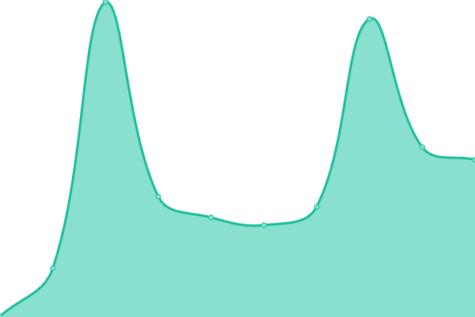
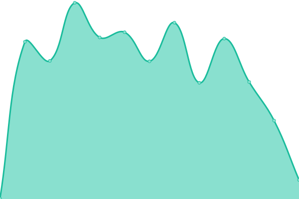

# [📈 Live Status](https://demo.upptime.js.org): <!--live status--> **🟩 All systems operational**

This repository contains the open-source uptime monitor and status page for [keviocastro](https://demo.upptime.js.org), powered by [Upptime](https://github.com/upptime/upptime).

With [Upptime](https://upptime.js.org), you can get your own unlimited and free uptime monitor and status page, powered entirely by a GitHub repository. We use [Issues](https://github.com/keviocastro/upptime/issues) as incident reports, [Actions](https://github.com/keviocastro/upptime/actions) as uptime monitors, and [Pages](https://demo.upptime.js.org) for the status page.

<!--start: status pages-->
<!-- This summary is generated by Upptime (https://github.com/upptime/upptime) -->
<!-- Do not edit this manually, your changes will be overwritten -->
<!-- prettier-ignore -->
| URL | Status | History | Response Time | Uptime |
| --- | ------ | ------- | ------------- | ------ |
|  [AUS (kty)](https://avus.com.br) | 🟩 Up | [aus-kty.yml](https://github.com/keviocastro/upptime/commits/HEAD/history/aus-kty.yml) | 

 6256ms
     
 | 

<a href="https://upptime.solidops.cloud/history/aus-kty">100.00%</a>
    

|  [FOXTIE (kty)](https://www.foxterciaimobiliaria.com.br) | 🟩 Up | [foxtie-kty.yml](https://github.com/keviocastro/upptime/commits/HEAD/history/foxtie-kty.yml) | 

 207ms
     
 | 

<a href="https://upptime.solidops.cloud/history/foxtie-kty">100.00%</a>
    

|  [FOXINT (kty)](https://foxter-integrations.konecty.com) | 🟩 Up | [foxint-kty.yml](https://github.com/keviocastro/upptime/commits/HEAD/history/foxint-kty.yml) | 

 393ms
     
 | 

<a href="https://upptime.solidops.cloud/history/foxint-kty">100.00%</a>
    

|  [FOXINT (kty)](https://foxter-integrations.konecty.com) | 🟩 Up | [foxint-kty.yml](https://github.com/keviocastro/upptime/commits/HEAD/history/foxint-kty.yml) | 

 393ms
     
 | 

<a href="https://upptime.solidops.cloud/history/foxint-kty">100.00%</a>
    

|  [FOXCAMPIN (kty)](https://foxter-activecampaign.konecty.com) | 🟩 Up | [foxcampin-kty.yml](https://github.com/keviocastro/upptime/commits/HEAD/history/foxcampin-kty.yml) | 

 403ms
     
 | 

<a href="https://upptime.solidops.cloud/history/foxcampin-kty">100.00%</a>
    

|  [FOXFLOWV2 (kty)](https://foxter-flows-v2.konecty.com) | 🟩 Up | [foxflowv-2-kty.yml](https://github.com/keviocastro/upptime/commits/HEAD/history/foxflowv-2-kty.yml) | 

 368ms
     
 | 

<a href="https://upptime.solidops.cloud/history/foxflowv-2-kty">100.00%</a>
    

|  [FOXMAILGUN (kty)](https://foxter-mailgun.konecty.com) | 🟩 Up | [foxmailgun-kty.yml](https://github.com/keviocastro/upptime/commits/HEAD/history/foxmailgun-kty.yml) | 

 426ms
     
 | 

<a href="https://upptime.solidops.cloud/history/foxmailgun-kty">100.00%</a>
    

|  [FOXPUSH (kty)](https://foxter-push.konecty.com) | 🟩 Up | [foxpush-kty.yml](https://github.com/keviocastro/upptime/commits/HEAD/history/foxpush-kty.yml) | 

 391ms
     
 | 

<a href="https://upptime.solidops.cloud/history/foxpush-kty">100.00%</a>
    

|  [FOXINTEGR (kty)](https://foxter-integrations.konecty.com) | 🟩 Up | [foxintegr-kty.yml](https://github.com/keviocastro/upptime/commits/HEAD/history/foxintegr-kty.yml) | 

 400ms
     
 | 

<a href="https://upptime.solidops.cloud/history/foxintegr-kty">100.00%</a>
    

|  [FOXDOWN (kty)](https://foxter-downloads.konecty.com) | 🟩 Up | [foxdown-kty.yml](https://github.com/keviocastro/upptime/commits/HEAD/history/foxdown-kty.yml) | 

 414ms
     
 | 

<a href="https://upptime.solidops.cloud/history/foxdown-kty">100.00%</a>
    

|  FOXSOLINK (kty) | 🟩 Up | [foxsolink-kty.yml](https://github.com/keviocastro/upptime/commits/HEAD/history/foxsolink-kty.yml) | 

 370ms
     
 | 

<a href="https://upptime.solidops.cloud/history/foxsolink-kty">100.00%</a>
    

<!--end: status pages-->

[**Visit our status website →**](https://demo.upptime.js.org)

## 📄 License

- Powered by: [Upptime](https://github.com/upptime/upptime)
- Code: [MIT](./LICENSE) © [keviocastro](https://demo.upptime.js.org)
- Data in the `./history` directory: [Open Database License](https://opendatacommons.org/licenses/odbl/1-0/)
