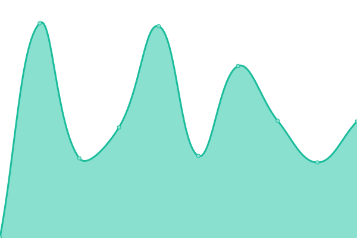
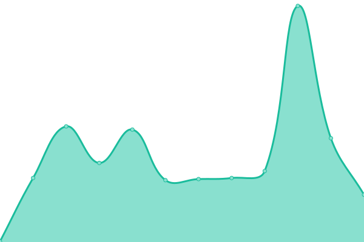
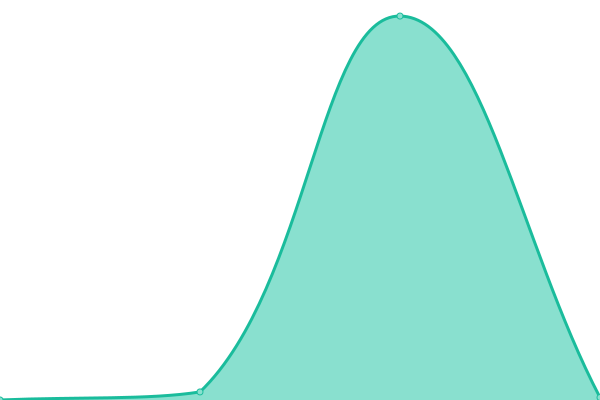

# [📈 Live Status](https://demo.upptime.js.org): <!--live status--> **🟩 All systems operational**

This repository contains the open-source uptime monitor and status page for [keviocastro](https://demo.upptime.js.org), powered by [Upptime](https://github.com/upptime/upptime).

With [Upptime](https://upptime.js.org), you can get your own unlimited and free uptime monitor and status page, powered entirely by a GitHub repository. We use [Issues](https://github.com/keviocastro/upptime/issues) as incident reports, [Actions](https://github.com/keviocastro/upptime/actions) as uptime monitors, and [Pages](https://demo.upptime.js.org) for the status page.

<!--start: status pages-->
<!-- This summary is generated by Upptime (https://github.com/upptime/upptime) -->
<!-- Do not edit this manually, your changes will be overwritten -->
<!-- prettier-ignore -->
| URL | Status | History | Response Time | Uptime |
| --- | ------ | ------- | ------------- | ------ |
|  [FX ACTIVE CAMPAIN (kty)](https://foxter-activecampaign.konecty.com) | 🟩 Up | [fx-active-campain-kty.yml](https://github.com/keviocastro/upptime/commits/HEAD/history/fx-active-campain-kty.yml) | 

 374ms
     
 | 

<a href="https://upptime.solidops.cloud/history/fx-active-campain-kty">100.00%</a>
    

|  [FX FLOWV2 (kty)](https://foxter-flows-v2.konecty.com) | 🟩 Up | [fx-flowv-2-kty.yml](https://github.com/keviocastro/upptime/commits/HEAD/history/fx-flowv-2-kty.yml) | 

 392ms
     
 | 

<a href="https://upptime.solidops.cloud/history/fx-flowv-2-kty">100.00%</a>
    

|  [FX MAILGUN (kty)](https://foxter-mailgun.konecty.com) | 🟩 Up | [fx-mailgun-kty.yml](https://github.com/keviocastro/upptime/commits/HEAD/history/fx-mailgun-kty.yml) | 

 354ms
     
 | 

<a href="https://upptime.solidops.cloud/history/fx-mailgun-kty">100.00%</a>
    

|  [FX PUSH (kty)](https://foxter-push.konecty.com) | 🟩 Up | [fx-push-kty.yml](https://github.com/keviocastro/upptime/commits/HEAD/history/fx-push-kty.yml) | 

 377ms
     
 | 

<a href="https://upptime.solidops.cloud/history/fx-push-kty">100.00%</a>
    

|  [FX INTEGRATIONS (kty)](https://foxter-integrations.konecty.com) | 🟩 Up | [fx-integrations-kty.yml](https://github.com/keviocastro/upptime/commits/HEAD/history/fx-integrations-kty.yml) | 

 597ms
     
 | 

<a href="https://upptime.solidops.cloud/history/fx-integrations-kty">100.00%</a>
    

|  [FX file server (kty)](https://foxter-downloads.konecty.com) | 🟩 Up | [fx-file-server-kty.yml](https://github.com/keviocastro/upptime/commits/HEAD/history/fx-file-server-kty.yml) | 

 347ms
     
 | 

<a href="https://upptime.solidops.cloud/history/fx-file-server-kty">100.00%</a>
    

|  FX SOCIAL LINK (kty) | 🟩 Up | [fx-social-link-kty.yml](https://github.com/keviocastro/upptime/commits/HEAD/history/fx-social-link-kty.yml) | 

 357ms
     
 | 

<a href="https://upptime.solidops.cloud/history/fx-social-link-kty">100.00%</a>
    

|  [FX ALPHA API (kty)](https://alpha-api.foxterciaimobiliaria.com.br) | 🟩 Up | [fx-alpha-api-kty.yml](https://github.com/keviocastro/upptime/commits/HEAD/history/fx-alpha-api-kty.yml) | 

 311ms
     
 | 

<a href="https://upptime.solidops.cloud/history/fx-alpha-api-kty">100.00%</a>
    

|  [FX ALPHA (kty)](https://alpha.foxterciaimobiliaria.com.br) | 🟩 Up | [fx-alpha-kty.yml](https://github.com/keviocastro/upptime/commits/HEAD/history/fx-alpha-kty.yml) | 

 5444ms
     
 | 

<a href="https://upptime.solidops.cloud/history/fx-alpha-kty">100.00%</a>
    

|  [FX atendimento (kty)](https://foxter-atendimento.konecty.com) | 🟩 Up | [fx-atendimento-kty.yml](https://github.com/keviocastro/upptime/commits/HEAD/history/fx-atendimento-kty.yml) | 

 349ms
     
 | 

<a href="https://upptime.solidops.cloud/history/fx-atendimento-kty">100.00%</a>
    

|  [FX rocket (kty)](https://rocketchat.foxter.konecty.com) | 🟩 Up | [fx-rocket-kty.yml](https://github.com/keviocastro/upptime/commits/HEAD/history/fx-rocket-kty.yml) | 

 700ms
     
 | 

<a href="https://upptime.solidops.cloud/history/fx-rocket-kty">100.00%</a>
    

|  [FX oferta (kty)](https://ofertaativa.foxterciaimobiliaria.com.br) | 🟩 Up | [fx-oferta-kty.yml](https://github.com/keviocastro/upptime/commits/HEAD/history/fx-oferta-kty.yml) | 

 302ms
     
 | 

<a href="https://upptime.solidops.cloud/history/fx-oferta-kty">100.00%</a>
    

|  [FX apps (kty)](https://foxter-apps.konecty.com) | 🟩 Up | [fx-apps-kty.yml](https://github.com/keviocastro/upptime/commits/HEAD/history/fx-apps-kty.yml) | 

 561ms
     
 | 

<a href="https://upptime.solidops.cloud/history/fx-apps-kty">100.00%</a>
    

|  [FX kty (kty)](https://foxter.konecty.com) | 🟩 Up | [fx-kty-kty.yml](https://github.com/keviocastro/upptime/commits/HEAD/history/fx-kty-kty.yml) | 

 627ms
     
 | 

<a href="https://upptime.solidops.cloud/history/fx-kty-kty">100.00%</a>
    

|  [FX kty hom (kty)](https://foxter-hom.konecty.com) | 🟩 Up | [fx-kty-hom-kty.yml](https://github.com/keviocastro/upptime/commits/HEAD/history/fx-kty-hom-kty.yml) | 

 565ms
     
 | 

<a href="https://upptime.solidops.cloud/history/fx-kty-hom-kty">100.00%</a>
    

|  [FX perdigueiro amp (kty)](https://amp.perdigueiroimoveis.com.br) | 🟩 Up | [fx-perdigueiro-amp-kty.yml](https://github.com/keviocastro/upptime/commits/HEAD/history/fx-perdigueiro-amp-kty.yml) | 

 635ms
     
 | 

<a href="https://upptime.solidops.cloud/history/fx-perdigueiro-amp-kty">100.00%</a>
    

|  [FX perdigueiro (kty)](https://perdigueiroimoveis.com.br) | 🟩 Up | [fx-perdigueiro-kty.yml](https://github.com/keviocastro/upptime/commits/HEAD/history/fx-perdigueiro-kty.yml) | 

 1995ms
     
 | 

<a href="https://upptime.solidops.cloud/history/fx-perdigueiro-kty">100.00%</a>
    

|  [FX portal 1 (kty)](https://festivalfoxter.com.br) | 🟩 Up | [fx-portal-1-kty.yml](https://github.com/keviocastro/upptime/commits/HEAD/history/fx-portal-1-kty.yml) | 

 5542ms
     
 | 

<a href="https://upptime.solidops.cloud/history/fx-portal-1-kty">100.00%</a>
    

|  [FX portal 2 (kty)](https://megafestivalfoxter.com.br) | 🟩 Up | [fx-portal-2-kty.yml](https://github.com/keviocastro/upptime/commits/HEAD/history/fx-portal-2-kty.yml) | 

 5732ms
     
 | 

<a href="https://upptime.solidops.cloud/history/fx-portal-2-kty">100.00%</a>
    

|  [FX portal 3 (kty)](https://foxterciaimobiliaria.com.br) | 🟩 Up | [fx-portal-3-kty.yml](https://github.com/keviocastro/upptime/commits/HEAD/history/fx-portal-3-kty.yml) | 

 5413ms
     
 | 

<a href="https://upptime.solidops.cloud/history/fx-portal-3-kty">100.00%</a>
    

|  [FX portal 4 (kty)](https://foxterciaimobiliaria.com.br) | 🟩 Up | [fx-portal-4-kty.yml](https://github.com/keviocastro/upptime/commits/HEAD/history/fx-portal-4-kty.yml) | 

 5237ms
     
 | 

<a href="https://upptime.solidops.cloud/history/fx-portal-4-kty">100.00%</a>
    

|  [FX portal api (kty)](https://api.foxterciaimobiliaria.com.br) | 🟩 Up | [fx-portal-api-kty.yml](https://github.com/keviocastro/upptime/commits/HEAD/history/fx-portal-api-kty.yml) | 

 245ms
     
 | 

<a href="https://upptime.solidops.cloud/history/fx-portal-api-kty">100.00%</a>
    

|  [FX conteudos pages 4 (kty)](https://financiamento.foxterciaimobiliaria.com.br) | 🟩 Up | [fx-conteudos-pages-4-kty.yml](https://github.com/keviocastro/upptime/commits/HEAD/history/fx-conteudos-pages-4-kty.yml) | 

 5148ms
     
 | 

<a href="https://upptime.solidops.cloud/history/fx-conteudos-pages-4-kty">100.00%</a>
    

|  [FX corretor (kty)](https://conexao.foxterciaimobiliaria.com.br) | 🟩 Up | [fx-corretor-kty.yml](https://github.com/keviocastro/upptime/commits/HEAD/history/fx-corretor-kty.yml) | 

 4815ms
     
 | 

<a href="https://upptime.solidops.cloud/history/fx-corretor-kty">100.00%</a>
    

|  [FX corretor (kty)](https://corretores.foxterciaimobiliaria.com.br) | 🟩 Up | [fx-corretor-kty.yml](https://github.com/keviocastro/upptime/commits/HEAD/history/fx-corretor-kty.yml) | 

 4815ms
     
 | 

<a href="https://upptime.solidops.cloud/history/fx-corretor-kty">100.00%</a>
    

|  [FX net (kty)](https://foxter.net.br) | 🟩 Up | [fx-net-kty.yml](https://github.com/keviocastro/upptime/commits/HEAD/history/fx-net-kty.yml) | 

 303ms
     
 | 

<a href="https://upptime.solidops.cloud/history/fx-net-kty">100.00%</a>
    

|  [FX net (kty)](https://novidadeimobiliaria.com.br) | 🟩 Up | [fx-net-kty.yml](https://github.com/keviocastro/upptime/commits/HEAD/history/fx-net-kty.yml) | 

 303ms
     
 | 

<a href="https://upptime.solidops.cloud/history/fx-net-kty">100.00%</a>
    

|  [FX net (kty)](https://novidadeimobiliaria.com.br) | 🟩 Up | [fx-net-kty.yml](https://github.com/keviocastro/upptime/commits/HEAD/history/fx-net-kty.yml) | 

 303ms
     
 | 

<a href="https://upptime.solidops.cloud/history/fx-net-kty">100.00%</a>
    

|  [AVS chat (kty)](https://chat.avus.com.br) | 🟩 Up | [avs-chat-kty.yml](https://github.com/keviocastro/upptime/commits/HEAD/history/avs-chat-kty.yml) | 

 378ms
     
 | 

<a href="https://upptime.solidops.cloud/history/avs-chat-kty">100.00%</a>
    

|  [AVS integration (kty)](https://avus-integrations.konecty.com) | 🟩 Up | [avs-integration-kty.yml](https://github.com/keviocastro/upptime/commits/HEAD/history/avs-integration-kty.yml) | 

 213ms
     
 | 

<a href="https://upptime.solidops.cloud/history/avs-integration-kty">100.00%</a>
    

|  [AVS  (kty)](https://) | 🟩 Up | [avs-kty.yml](https://github.com/keviocastro/upptime/commits/HEAD/history/avs-kty.yml) | 

 6300ms
     
 | 

<a href="https://upptime.solidops.cloud/history/avs-kty">99.60%</a>
    

|  [AVS kty (kty)](https://avus.konecty.com) | 🟩 Up | [avs-kty-kty.yml](https://github.com/keviocastro/upptime/commits/HEAD/history/avs-kty-kty.yml) | 

 659ms
     
 | 

<a href="https://upptime.solidops.cloud/history/avs-kty-kty">100.00%</a>
    

|  [AVS site kty  (kty)](https://avus-site.konecty.com) | 🟩 Up | [avs-site-kty-kty.yml](https://github.com/keviocastro/upptime/commits/HEAD/history/avs-site-kty-kty.yml) | 

 469ms
     
 | 

<a href="https://upptime.solidops.cloud/history/avs-site-kty-kty">100.00%</a>
    

|  [AVS api  (kty)](https://api.avus.com.br) | 🟩 Up | [avs-api-kty.yml](https://github.com/keviocastro/upptime/commits/HEAD/history/avs-api-kty.yml) | 

 283ms
     
 | 

<a href="https://upptime.solidops.cloud/history/avs-api-kty">100.00%</a>
    

|  [AVS push api  (kty)](https://push-api.avus.com.br) | 🟩 Up | [avs-push-api-kty.yml](https://github.com/keviocastro/upptime/commits/HEAD/history/avs-push-api-kty.yml) | 

 906ms
     
 | 

<a href="https://upptime.solidops.cloud/history/avs-push-api-kty">100.00%</a>
    

|  [AVS (kty)](https://avus.com.br) | 🟩 Up | [avs-kty.yml](https://github.com/keviocastro/upptime/commits/HEAD/history/avs-kty.yml) | 

 6300ms
     
 | 

<a href="https://upptime.solidops.cloud/history/avs-kty">99.60%</a>
    

|  [AVS card (kty)](https://pancorretora.avus.com.br) | 🟩 Up | [avs-card-kty.yml](https://github.com/keviocastro/upptime/commits/HEAD/history/avs-card-kty.yml) | 

 10797ms
     
 | 

<a href="https://upptime.solidops.cloud/history/avs-card-kty">81.02%</a>
    

|  [AVS rgsp (kty)](https://rgsp.avus.com.br) | 🟩 Up | [avs-rgsp-kty.yml](https://github.com/keviocastro/upptime/commits/HEAD/history/avs-rgsp-kty.yml) | 

 5914ms
     
 | 

<a href="https://upptime.solidops.cloud/history/avs-rgsp-kty">100.00%</a>
    

|  [AVS too (kty)](https://too.avus.com.br) | 🟩 Up | [avs-too-kty.yml](https://github.com/keviocastro/upptime/commits/HEAD/history/avs-too-kty.yml) | 

 13451ms
     
 | 

<a href="https://upptime.solidops.cloud/history/avs-too-kty">100.00%</a>
    

|  [AVS portal saude (kty)](https://portaldesaude.avus.com.br) | 🟩 Up | [avs-portal-saude-kty.yml](https://github.com/keviocastro/upptime/commits/HEAD/history/avs-portal-saude-kty.yml) | 

 215ms
     
 | 

<a href="https://upptime.solidops.cloud/history/avs-portal-saude-kty">100.00%</a>
    

|  [AVS app (kty)](https://app.avus.com.br) | 🟩 Up | [avs-app-kty.yml](https://github.com/keviocastro/upptime/commits/HEAD/history/avs-app-kty.yml) | 

 7878ms
     
 | 

<a href="https://upptime.solidops.cloud/history/avs-app-kty">100.00%</a>
    

|  [AVS app avs](https://app-avus.konecty.com) | 🟩 Up | [avs-app-avs.yml](https://github.com/keviocastro/upptime/commits/HEAD/history/avs-app-avs.yml) | 

 7841ms
     
 | 

<a href="https://upptime.solidops.cloud/history/avs-app-avs">100.00%</a>
    

<!--end: status pages-->

[**Visit our status website →**](https://demo.upptime.js.org)

## 📄 License

- Powered by: [Upptime](https://github.com/upptime/upptime)
- Code: [MIT](./LICENSE) © [keviocastro](https://demo.upptime.js.org)
- Data in the `./history` directory: [Open Database License](https://opendatacommons.org/licenses/odbl/1-0/)
