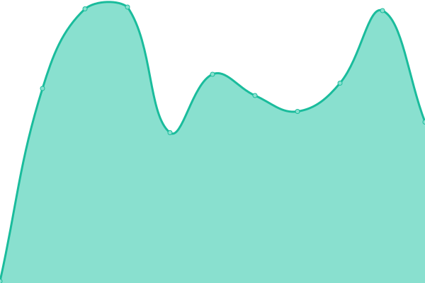
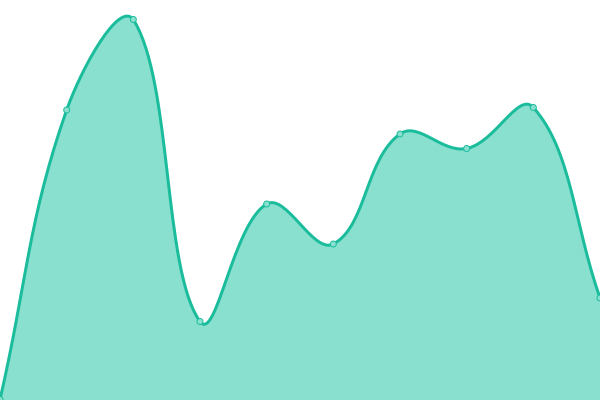
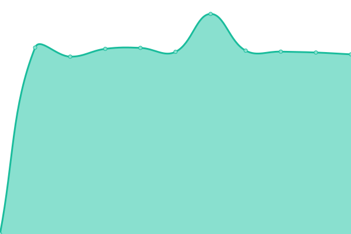
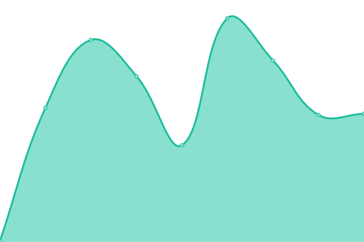
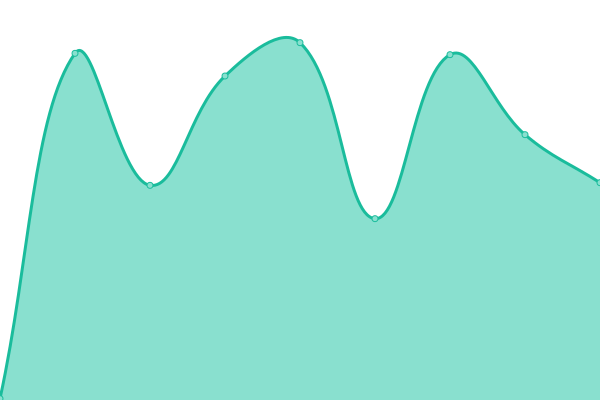
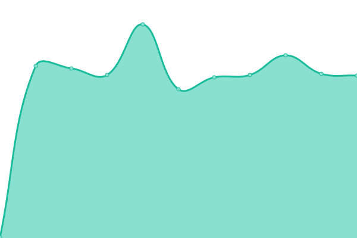

# [📈 Live Status](https://demo.upptime.js.org): <!--live status--> **🟧 Partial outage**

This repository contains the open-source uptime monitor and status page for [keviocastro](https://demo.upptime.js.org), powered by [Upptime](https://github.com/upptime/upptime).

With [Upptime](https://upptime.js.org), you can get your own unlimited and free uptime monitor and status page, powered entirely by a GitHub repository. We use [Issues](https://github.com/keviocastro/upptime/issues) as incident reports, [Actions](https://github.com/keviocastro/upptime/actions) as uptime monitors, and [Pages](https://demo.upptime.js.org) for the status page.

<!--start: status pages-->
<!-- This summary is generated by Upptime (https://github.com/upptime/upptime) -->
<!-- Do not edit this manually, your changes will be overwritten -->
<!-- prettier-ignore -->
| URL | Status | History | Response Time | Uptime |
| --- | ------ | ------- | ------------- | ------ |
|  [FX ACTIVE CAMPAIN (kty)](https://foxter-activecampaign.konecty.com) | 🟩 Up | [fx-active-campain-kty.yml](https://github.com/keviocastro/upptime/commits/HEAD/history/fx-active-campain-kty.yml) | 

 355ms
     
 | 

<a href="https://upptime.solidops.cloud/history/fx-active-campain-kty">100.00%</a>
    

|  [FX FLOWV2 (kty)](https://foxter-flows-v2.konecty.com) | 🟩 Up | [fx-flowv-2-kty.yml](https://github.com/keviocastro/upptime/commits/HEAD/history/fx-flowv-2-kty.yml) | 

 370ms
     
 | 

<a href="https://upptime.solidops.cloud/history/fx-flowv-2-kty">99.00%</a>
    

|  [FX MAILGUN (kty)](https://foxter-mailgun.konecty.com) | 🟩 Up | [fx-mailgun-kty.yml](https://github.com/keviocastro/upptime/commits/HEAD/history/fx-mailgun-kty.yml) | 

 374ms
     
 | 

<a href="https://upptime.solidops.cloud/history/fx-mailgun-kty">100.00%</a>
    

|  [FX PUSH (kty)](https://foxter-push.konecty.com) | 🟩 Up | [fx-push-kty.yml](https://github.com/keviocastro/upptime/commits/HEAD/history/fx-push-kty.yml) | 

 342ms
     
 | 

<a href="https://upptime.solidops.cloud/history/fx-push-kty">100.00%</a>
    

|  [FX INTEGRATIONS (kty)](https://foxter-integrations.konecty.com) | 🟩 Up | [fx-integrations-kty.yml](https://github.com/keviocastro/upptime/commits/HEAD/history/fx-integrations-kty.yml) | 

 413ms
     
 | 

<a href="https://upptime.solidops.cloud/history/fx-integrations-kty">100.00%</a>
    

|  [FX file server (kty)](https://foxter-downloads.konecty.com) | 🟩 Up | [fx-file-server-kty.yml](https://github.com/keviocastro/upptime/commits/HEAD/history/fx-file-server-kty.yml) | 

 351ms
     
 | 

<a href="https://upptime.solidops.cloud/history/fx-file-server-kty">100.00%</a>
    

|  FX SOCIAL LINK (kty) | 🟩 Up | [fx-social-link-kty.yml](https://github.com/keviocastro/upptime/commits/HEAD/history/fx-social-link-kty.yml) | 

 342ms
     
 | 

<a href="https://upptime.solidops.cloud/history/fx-social-link-kty">100.00%</a>
    

|  [FX ALPHA API (kty)](https://alpha-api.foxterciaimobiliaria.com.br) | 🟩 Up | [fx-alpha-api-kty.yml](https://github.com/keviocastro/upptime/commits/HEAD/history/fx-alpha-api-kty.yml) | 

 301ms
     
 | 

<a href="https://upptime.solidops.cloud/history/fx-alpha-api-kty">99.60%</a>
    

|  [FX ALPHA (kty)](https://alpha.foxterciaimobiliaria.com.br) | 🟩 Up | [fx-alpha-kty.yml](https://github.com/keviocastro/upptime/commits/HEAD/history/fx-alpha-kty.yml) | 

 5300ms
     
 | 

<a href="https://upptime.solidops.cloud/history/fx-alpha-kty">99.60%</a>
    

|  [FX atendimento (kty)](https://foxter-atendimento.konecty.com) | 🟩 Up | [fx-atendimento-kty.yml](https://github.com/keviocastro/upptime/commits/HEAD/history/fx-atendimento-kty.yml) | 

 339ms
     
 | 

<a href="https://upptime.solidops.cloud/history/fx-atendimento-kty">99.45%</a>
    

|  [FX rocket (kty)](https://rocketchat.foxter.konecty.com) | 🟩 Up | [fx-rocket-kty.yml](https://github.com/keviocastro/upptime/commits/HEAD/history/fx-rocket-kty.yml) | 

 527ms
     
 | 

<a href="https://upptime.solidops.cloud/history/fx-rocket-kty">100.00%</a>
    

|  [FX oferta (kty)](https://ofertaativa.foxterciaimobiliaria.com.br) | 🟩 Up | [fx-oferta-kty.yml](https://github.com/keviocastro/upptime/commits/HEAD/history/fx-oferta-kty.yml) | 

 283ms
     
 | 

<a href="https://upptime.solidops.cloud/history/fx-oferta-kty">100.00%</a>
    

|  [FX apps (kty)](https://foxter-apps.konecty.com) | 🟩 Up | [fx-apps-kty.yml](https://github.com/keviocastro/upptime/commits/HEAD/history/fx-apps-kty.yml) | 

 556ms
     
 | 

<a href="https://upptime.solidops.cloud/history/fx-apps-kty">99.45%</a>
    

|  [FX kty (kty)](https://foxter.konecty.com) | 🟩 Up | [fx-kty-kty.yml](https://github.com/keviocastro/upptime/commits/HEAD/history/fx-kty-kty.yml) | 

 625ms
     
 | 

<a href="https://upptime.solidops.cloud/history/fx-kty-kty">98.96%</a>
    

|  [FX kty hom (kty)](https://foxter-hom.konecty.com) | 🟩 Up | [fx-kty-hom-kty.yml](https://github.com/keviocastro/upptime/commits/HEAD/history/fx-kty-hom-kty.yml) | 

 636ms
     
 | 

<a href="https://upptime.solidops.cloud/history/fx-kty-hom-kty">100.00%</a>
    

|  [FX perdigueiro amp (kty)](https://amp.perdigueiroimoveis.com.br) | 🟩 Up | [fx-perdigueiro-amp-kty.yml](https://github.com/keviocastro/upptime/commits/HEAD/history/fx-perdigueiro-amp-kty.yml) | 

 622ms
     
 | 

<a href="https://upptime.solidops.cloud/history/fx-perdigueiro-amp-kty">100.00%</a>
    

|  [FX perdigueiro (kty)](https://perdigueiroimoveis.com.br) | 🟩 Up | [fx-perdigueiro-kty.yml](https://github.com/keviocastro/upptime/commits/HEAD/history/fx-perdigueiro-kty.yml) | 

 2466ms
     
 | 

<a href="https://upptime.solidops.cloud/history/fx-perdigueiro-kty">96.30%</a>
    

|  [FX portal 1 (kty)](https://festivalfoxter.com.br) | 🟩 Up | [fx-portal-1-kty.yml](https://github.com/keviocastro/upptime/commits/HEAD/history/fx-portal-1-kty.yml) | 

 5120ms
     
 | 

<a href="https://upptime.solidops.cloud/history/fx-portal-1-kty">100.00%</a>
    

|  [FX portal 2 (kty)](https://megafestivalfoxter.com.br) | 🟩 Up | [fx-portal-2-kty.yml](https://github.com/keviocastro/upptime/commits/HEAD/history/fx-portal-2-kty.yml) | 

 5277ms
     
 | 

<a href="https://upptime.solidops.cloud/history/fx-portal-2-kty">100.00%</a>
    

|  [FX portal 3 (kty)](https://foxterciaimobiliaria.com.br) | 🟩 Up | [fx-portal-3-kty.yml](https://github.com/keviocastro/upptime/commits/HEAD/history/fx-portal-3-kty.yml) | 

 5173ms
     
 | 

<a href="https://upptime.solidops.cloud/history/fx-portal-3-kty">100.00%</a>
    

|  [FX portal 4 (kty)](https://foxterciaimobiliaria.com.br) | 🟩 Up | [fx-portal-4-kty.yml](https://github.com/keviocastro/upptime/commits/HEAD/history/fx-portal-4-kty.yml) | 

 5562ms
     
 | 

<a href="https://upptime.solidops.cloud/history/fx-portal-4-kty">100.00%</a>
    

|  [FX portal api (kty)](https://api.foxterciaimobiliaria.com.br) | 🟩 Up | [fx-portal-api-kty.yml](https://github.com/keviocastro/upptime/commits/HEAD/history/fx-portal-api-kty.yml) | 

 249ms
     
 | 

<a href="https://upptime.solidops.cloud/history/fx-portal-api-kty">100.00%</a>
    

|  [FX conteudos pages 4 (kty)](https://financiamento.foxterciaimobiliaria.com.br) | 🟩 Up | [fx-conteudos-pages-4-kty.yml](https://github.com/keviocastro/upptime/commits/HEAD/history/fx-conteudos-pages-4-kty.yml) | 

 3183ms
     
 | 

<a href="https://upptime.solidops.cloud/history/fx-conteudos-pages-4-kty">100.00%</a>
    

|  [FX corretor (kty)](https://conexao.foxterciaimobiliaria.com.br) | 🟩 Up | [fx-corretor-kty.yml](https://github.com/keviocastro/upptime/commits/HEAD/history/fx-corretor-kty.yml) | 

 4326ms
     
 | 

<a href="https://upptime.solidops.cloud/history/fx-corretor-kty">100.00%</a>
    

|  [FX corretor (kty)](https://corretores.foxterciaimobiliaria.com.br) | 🟩 Up | [fx-corretor-kty.yml](https://github.com/keviocastro/upptime/commits/HEAD/history/fx-corretor-kty.yml) | 

 4326ms
     
 | 

<a href="https://upptime.solidops.cloud/history/fx-corretor-kty">100.00%</a>
    

|  [FX net (kty)](https://foxter.net.br) | 🟩 Up | [fx-net-kty.yml](https://github.com/keviocastro/upptime/commits/HEAD/history/fx-net-kty.yml) | 

 318ms
     
 | 

<a href="https://upptime.solidops.cloud/history/fx-net-kty">100.00%</a>
    

|  [FX net (kty)](https://novidadeimobiliaria.com.br) | 🟩 Up | [fx-net-kty.yml](https://github.com/keviocastro/upptime/commits/HEAD/history/fx-net-kty.yml) | 

 318ms
     
 | 

<a href="https://upptime.solidops.cloud/history/fx-net-kty">100.00%</a>
    

|  [FX net (kty)](https://novidadeimobiliaria.com.br) | 🟩 Up | [fx-net-kty.yml](https://github.com/keviocastro/upptime/commits/HEAD/history/fx-net-kty.yml) | 

 318ms
     
 | 

<a href="https://upptime.solidops.cloud/history/fx-net-kty">100.00%</a>
    

|  [AVS chat (kty)](https://chat.avus.com.br) | 🟩 Up | [avs-chat-kty.yml](https://github.com/keviocastro/upptime/commits/HEAD/history/avs-chat-kty.yml) | 

 289ms
     
 | 

<a href="https://upptime.solidops.cloud/history/avs-chat-kty">100.00%</a>
    

|  [AVS integration (kty)](https://avus-integrations.konecty.com) | 🟩 Up | [avs-integration-kty.yml](https://github.com/keviocastro/upptime/commits/HEAD/history/avs-integration-kty.yml) | 

 152ms
     
 | 

<a href="https://upptime.solidops.cloud/history/avs-integration-kty">100.00%</a>
    

|  [AVS kty (kty)](https://avus.konecty.com) | 🟩 Up | [avs-kty-kty.yml](https://github.com/keviocastro/upptime/commits/HEAD/history/avs-kty-kty.yml) | 

 300ms
     
 | 

<a href="https://upptime.solidops.cloud/history/avs-kty-kty">100.00%</a>
    

|  [AVS site kty  (kty)](https://avus-site.konecty.com) | 🟩 Up | [avs-site-kty-kty.yml](https://github.com/keviocastro/upptime/commits/HEAD/history/avs-site-kty-kty.yml) | 

 287ms
     
 | 

<a href="https://upptime.solidops.cloud/history/avs-site-kty-kty">100.00%</a>
    

|  [AVS api  (kty)](https://api.avus.com.br) | 🟩 Up | [avs-api-kty.yml](https://github.com/keviocastro/upptime/commits/HEAD/history/avs-api-kty.yml) | 

 267ms
     
 | 

<a href="https://upptime.solidops.cloud/history/avs-api-kty">100.00%</a>
    

|  [AVS push api  (kty)](https://push-api.avus.com.br) | 🟩 Up | [avs-push-api-kty.yml](https://github.com/keviocastro/upptime/commits/HEAD/history/avs-push-api-kty.yml) | 

 600ms
     
 | 

<a href="https://upptime.solidops.cloud/history/avs-push-api-kty">99.64%</a>
    

|  [AVS (kty)](https://avus.com.br) | 🟩 Up | [avs-kty.yml](https://github.com/keviocastro/upptime/commits/HEAD/history/avs-kty.yml) | 

 6335ms
     
 | 

<a href="https://upptime.solidops.cloud/history/avs-kty">100.00%</a>
    

|  [AVS card (kty)](https://pancorretora.avus.com.br) | 🟩 Up | [avs-card-kty.yml](https://github.com/keviocastro/upptime/commits/HEAD/history/avs-card-kty.yml) | 

 6385ms
     
 | 

<a href="https://upptime.solidops.cloud/history/avs-card-kty">99.66%</a>
    

|  [AVS rgsp (kty)](https://rgsp.avus.com.br) | 🟩 Up | [avs-rgsp-kty.yml](https://github.com/keviocastro/upptime/commits/HEAD/history/avs-rgsp-kty.yml) | 

 5912ms
     
 | 

<a href="https://upptime.solidops.cloud/history/avs-rgsp-kty">100.00%</a>
    

|  [AVS too (kty)](https://too.avus.com.br) | 🟩 Up | [avs-too-kty.yml](https://github.com/keviocastro/upptime/commits/HEAD/history/avs-too-kty.yml) | 

 6697ms
     
 | 

<a href="https://upptime.solidops.cloud/history/avs-too-kty">100.00%</a>
    

|  [AVS portal saude (kty)](https://portaldesaude.avus.com.br) | 🟩 Up | [avs-portal-saude-kty.yml](https://github.com/keviocastro/upptime/commits/HEAD/history/avs-portal-saude-kty.yml) | 

 183ms
     
 | 

<a href="https://upptime.solidops.cloud/history/avs-portal-saude-kty">100.00%</a>
    

|  [AVS app (kty)](https://app.avus.com.br) | 🟩 Up | [avs-app-kty.yml](https://github.com/keviocastro/upptime/commits/HEAD/history/avs-app-kty.yml) | 

 1025ms
     
 | 

<a href="https://upptime.solidops.cloud/history/avs-app-kty">100.00%</a>
    

|  [AVS app avs (kty)](https://app-avus.konecty.com) | 🟩 Up | [avs-app-avs-kty.yml](https://github.com/keviocastro/upptime/commits/HEAD/history/avs-app-avs-kty.yml) | 

 159ms
     
 | 

<a href="https://upptime.solidops.cloud/history/avs-app-avs-kty">100.00%</a>
    

|  [zuk kty (kty)](https://zuckhan.konecty.com) | 🟩 Up | [zuk-kty-kty.yml](https://github.com/keviocastro/upptime/commits/HEAD/history/zuk-kty-kty.yml) | 

 252ms
     
 | 

<a href="https://upptime.solidops.cloud/history/zuk-kty-kty">100.00%</a>
    

|  [zuk site (kty)](https://zuckhan.com.br) | 🟩 Up | [zuk-site-kty.yml](https://github.com/keviocastro/upptime/commits/HEAD/history/zuk-site-kty.yml) | 

 5527ms
     
 | 

<a href="https://upptime.solidops.cloud/history/zuk-site-kty">100.00%</a>
    

|  [urba blog guaiabapark (kty)](https://blog.guaibapark.com.br) | 🟩 Up | [urba-blog-guaiabapark-kty.yml](https://github.com/keviocastro/upptime/commits/HEAD/history/urba-blog-guaiabapark-kty.yml) | 

 305ms
     
 | 

<a href="https://upptime.solidops.cloud/history/urba-blog-guaiabapark-kty">100.00%</a>
    

|  [urba blog editor guaibapark (kty)](https://blogeditor.guaibapark.com.br) | 🟩 Up | [urba-blog-editor-guaibapark-kty.yml](https://github.com/keviocastro/upptime/commits/HEAD/history/urba-blog-editor-guaibapark-kty.yml) | 

 215ms
     
 | 

<a href="https://upptime.solidops.cloud/history/urba-blog-editor-guaibapark-kty">100.00%</a>
    

|  [urba blog (kty)](https://blog.urbacon.com.br) | 🟩 Up | [urba-blog-kty.yml](https://github.com/keviocastro/upptime/commits/HEAD/history/urba-blog-kty.yml) | 

 669ms
     
 | 

<a href="https://upptime.solidops.cloud/history/urba-blog-kty">100.00%</a>
    

|  [urba blog editor (kty)](https://urbacon-blogeditor.konecty.com) | 🟩 Up | [urba-blog-editor-kty.yml](https://github.com/keviocastro/upptime/commits/HEAD/history/urba-blog-editor-kty.yml) | 

 150ms
     
 | 

<a href="https://upptime.solidops.cloud/history/urba-blog-editor-kty">100.00%</a>
    

|  [urba chat (kty)](https://chat.urbacon.com.br) | 🟩 Up | [urba-chat-kty.yml](https://github.com/keviocastro/upptime/commits/HEAD/history/urba-chat-kty.yml) | 

 494ms
     
 | 

<a href="https://upptime.solidops.cloud/history/urba-chat-kty">100.00%</a>
    

|  [urba atendimento (kty)](https://atendimento-urbacon.konecty.com) | 🟩 Up | [urba-atendimento-kty.yml](https://github.com/keviocastro/upptime/commits/HEAD/history/urba-atendimento-kty.yml) | 

 124ms
     
 | 

<a href="https://upptime.solidops.cloud/history/urba-atendimento-kty">100.00%</a>
    

|  [urba integration (kty)](https://urbacon-integrations.konecty.com) | 🟩 Up | [urba-integration-kty.yml](https://github.com/keviocastro/upptime/commits/HEAD/history/urba-integration-kty.yml) | 

 154ms
     
 | 

<a href="https://upptime.solidops.cloud/history/urba-integration-kty">100.00%</a>
    

|  [urba kty (kty)](https://urbacon.konecty.com) | 🟩 Up | [urba-kty-kty.yml](https://github.com/keviocastro/upptime/commits/HEAD/history/urba-kty-kty.yml) | 

 247ms
     
 | 

<a href="https://upptime.solidops.cloud/history/urba-kty-kty">100.00%</a>
    

|  [urba site (kty)](https://urbacon.com.br) | 🟩 Up | [urba-site-kty.yml](https://github.com/keviocastro/upptime/commits/HEAD/history/urba-site-kty.yml) | 

 107ms
     
 | 

<a href="https://upptime.solidops.cloud/history/urba-site-kty">100.00%</a>
    

|  [sinisp kty (kty)](https://sinicesp.konecty.com) | 🟩 Up | [sinisp-kty-kty.yml](https://github.com/keviocastro/upptime/commits/HEAD/history/sinisp-kty-kty.yml) | 

 279ms
     
 | 

<a href="https://upptime.solidops.cloud/history/sinisp-kty-kty">100.00%</a>
    

|  [sinisp site (kty)](https://conexaopcd.com.br) | 🟩 Up | [sinisp-site-kty.yml](https://github.com/keviocastro/upptime/commits/HEAD/history/sinisp-site-kty.yml) | 

 7475ms
     
 | 

<a href="https://upptime.solidops.cloud/history/sinisp-site-kty">100.00%</a>
    

|  [maedeuz kty  (kty)](https://maededeus.konecty.com) | 🟩 Up | [maedeuz-kty-kty.yml](https://github.com/keviocastro/upptime/commits/HEAD/history/maedeuz-kty-kty.yml) | 

 253ms
     
 | 

<a href="https://upptime.solidops.cloud/history/maedeuz-kty-kty">100.00%</a>
    

|  [maedeuz site  (kty)](https://centroclinicomaededeus.med.br) | 🟩 Up | [maedeuz-site-kty.yml](https://github.com/keviocastro/upptime/commits/HEAD/history/maedeuz-site-kty.yml) | 

 372ms
     
 | 

<a href="https://upptime.solidops.cloud/history/maedeuz-site-kty">100.00%</a>
    

|  [lugge glob  (kty)](https://blog.luagge.com.br) | 🟩 Up | [lugge-glob-kty.yml](https://github.com/keviocastro/upptime/commits/HEAD/history/lugge-glob-kty.yml) | 

 388ms
     
 | 

<a href="https://upptime.solidops.cloud/history/lugge-glob-kty">100.00%</a>
    

|  [lugge glob editor  (kty)](https://luagge-blogeditor.konecty.com) | 🟩 Up | [lugge-glob-editor-kty.yml](https://github.com/keviocastro/upptime/commits/HEAD/history/lugge-glob-editor-kty.yml) | 

 153ms
     
 | 

<a href="https://upptime.solidops.cloud/history/lugge-glob-editor-kty">100.00%</a>
    

|  [lugge kty  (kty)](https://luagge.konecty.com) | 🟩 Up | [lugge-kty-kty.yml](https://github.com/keviocastro/upptime/commits/HEAD/history/lugge-kty-kty.yml) | 

 255ms
     
 | 

<a href="https://upptime.solidops.cloud/history/lugge-kty-kty">100.00%</a>
    

|  [lugge site  (kty)](https://luagge.com.br) | 🟩 Up | [lugge-site-kty.yml](https://github.com/keviocastro/upptime/commits/HEAD/history/lugge-site-kty.yml) | 

 6014ms
     
 | 

<a href="https://upptime.solidops.cloud/history/lugge-site-kty">100.00%</a>
    

|  [krystal kty (kty)](https://krystal.konecty.com) | 🟩 Up | [krystal-kty-kty.yml](https://github.com/keviocastro/upptime/commits/HEAD/history/krystal-kty-kty.yml) | 

 271ms
     
 | 

<a href="https://upptime.solidops.cloud/history/krystal-kty-kty">100.00%</a>
    

|  [krystal site (kty)](https://krystal.com.br) | 🟩 Up | [krystal-site-kty.yml](https://github.com/keviocastro/upptime/commits/HEAD/history/krystal-site-kty.yml) | 

 6233ms
     
 | 

<a href="https://upptime.solidops.cloud/history/krystal-site-kty">100.00%</a>
    

|  [savar kty (kty)](https://gruposavar.konecty.com) | 🟩 Up | [savar-kty-kty.yml](https://github.com/keviocastro/upptime/commits/HEAD/history/savar-kty-kty.yml) | 

 249ms
     
 | 

<a href="https://upptime.solidops.cloud/history/savar-kty-kty">100.00%</a>
    

|  [savar site (kty)](https://gruposavar.com.br) | 🟩 Up | [savar-site-kty.yml](https://github.com/keviocastro/upptime/commits/HEAD/history/savar-site-kty.yml) | 

 317ms
     
 | 

<a href="https://upptime.solidops.cloud/history/savar-site-kty">100.00%</a>
    

|  [grow kty (kty)](https://growplus.konecty.com) | 🟩 Up | [grow-kty-kty.yml](https://github.com/keviocastro/upptime/commits/HEAD/history/grow-kty-kty.yml) | 

 239ms
     
 | 

<a href="https://upptime.solidops.cloud/history/grow-kty-kty">100.00%</a>
    

|  [grow site (kty)](https://gruposavar.com.br) | 🟩 Up | [grow-site-kty.yml](https://github.com/keviocastro/upptime/commits/HEAD/history/grow-site-kty.yml) | 

 30ms
     
 | 

<a href="https://upptime.solidops.cloud/history/grow-site-kty">100.00%</a>
    

|  [esquadria atendiemnto (kty)](https://atendimento-prata.konecty.com) | 🟩 Up | [esquadria-atendiemnto-kty.yml](https://github.com/keviocastro/upptime/commits/HEAD/history/esquadria-atendiemnto-kty.yml) | 

 144ms
     
 | 

<a href="https://upptime.solidops.cloud/history/esquadria-atendiemnto-kty">100.00%</a>
    

|  [esquadria kty (kty)](https://esquadriasprata.konecty.com) | 🟩 Up | [esquadria-kty-kty.yml](https://github.com/keviocastro/upptime/commits/HEAD/history/esquadria-kty-kty.yml) | 

 239ms
     
 | 

<a href="https://upptime.solidops.cloud/history/esquadria-kty-kty">100.00%</a>
    

|  [egali blog edtior (kty)](https://egalite-blogeditor.konecty.com) | 🟩 Up | [egali-blog-edtior-kty.yml](https://github.com/keviocastro/upptime/commits/HEAD/history/egali-blog-edtior-kty.yml) | 

 144ms
     
 | 

<a href="https://upptime.solidops.cloud/history/egali-blog-edtior-kty">100.00%</a>
    

|  [egali chat (kty)](https://chat.incluipcd.com.br) | 🟩 Up | [egali-chat-kty.yml](https://github.com/keviocastro/upptime/commits/HEAD/history/egali-chat-kty.yml) | 

 277ms
     
 | 

<a href="https://upptime.solidops.cloud/history/egali-chat-kty">100.00%</a>
    

|  [egali kty (kty)](https://egalite.konecty.com) | 🟩 Up | [egali-kty-kty.yml](https://github.com/keviocastro/upptime/commits/HEAD/history/egali-kty-kty.yml) | 

 221ms
     
 | 

<a href="https://upptime.solidops.cloud/history/egali-kty-kty">100.00%</a>
    

|  [egali flows (kty)](https://egalite-flows.konecty.com) | 🟩 Up | [egali-flows-kty.yml](https://github.com/keviocastro/upptime/commits/HEAD/history/egali-flows-kty.yml) | 

 147ms
     
 | 

<a href="https://upptime.solidops.cloud/history/egali-flows-kty">100.00%</a>
    

|  [egali integrations (kty)](https://egalite-integrations.konecty.com) | 🟩 Up | [egali-integrations-kty.yml](https://github.com/keviocastro/upptime/commits/HEAD/history/egali-integrations-kty.yml) | 

 143ms
     
 | 

<a href="https://upptime.solidops.cloud/history/egali-integrations-kty">100.00%</a>
    

|  [egali site (kty)](https://egalite.com.br) | 🟩 Up | [egali-site-kty.yml](https://github.com/keviocastro/upptime/commits/HEAD/history/egali-site-kty.yml) | 

 313ms
     
 | 

<a href="https://upptime.solidops.cloud/history/egali-site-kty">100.00%</a>
    

|  [egali incluipcd (kty)](https://incluipcd.com.br) | 🟩 Up | [egali-incluipcd-kty.yml](https://github.com/keviocastro/upptime/commits/HEAD/history/egali-incluipcd-kty.yml) | 

 5762ms
     
 | 

<a href="https://upptime.solidops.cloud/history/egali-incluipcd-kty">100.00%</a>
    

|  [egali pcdbrasil (kty)](https://pcdbrasil.com.br) | 🟩 Up | [egali-pcdbrasil-kty.yml](https://github.com/keviocastro/upptime/commits/HEAD/history/egali-pcdbrasil-kty.yml) | 

 6179ms
     
 | 

<a href="https://upptime.solidops.cloud/history/egali-pcdbrasil-kty">100.00%</a>
    

|  [davog kty (kty)](https://davoglio.konecty.com) | 🟩 Up | [davog-kty-kty.yml](https://github.com/keviocastro/upptime/commits/HEAD/history/davog-kty-kty.yml) | 

 237ms
     
 | 

<a href="https://upptime.solidops.cloud/history/davog-kty-kty">100.00%</a>
    

|  [davog representante (kty)](https://davoglio.com.br) | 🟩 Up | [davog-representante-kty.yml](https://github.com/keviocastro/upptime/commits/HEAD/history/davog-representante-kty.yml) | 

 966ms
     
 | 

<a href="https://upptime.solidops.cloud/history/davog-representante-kty">100.00%</a>
    

|  [konecty site](https://konecty.com) | 🟩 Up | [konecty-site.yml](https://github.com/keviocastro/upptime/commits/HEAD/history/konecty-site.yml) | 

 5982ms
     
 | 

<a href="https://upptime.solidops.cloud/history/konecty-site">100.00%</a>
    

|  [konecty chate](https://chat.konecty.com) | 🟩 Up | [konecty-chate.yml](https://github.com/keviocastro/upptime/commits/HEAD/history/konecty-chate.yml) | 

 254ms
     
 | 

<a href="https://upptime.solidops.cloud/history/konecty-chate">100.00%</a>
    

|  [konecty flows](https://flows.konecty.com) | 🟩 Up | [konecty-flows.yml](https://github.com/keviocastro/upptime/commits/HEAD/history/konecty-flows.yml) | 

 156ms
     
 | 

<a href="https://upptime.solidops.cloud/history/konecty-flows">100.00%</a>
    

|  [konecty konecty](https://konecty.konecty.com) | 🟩 Up | [konecty-konecty.yml](https://github.com/keviocastro/upptime/commits/HEAD/history/konecty-konecty.yml) | 

 267ms
     
 | 

<a href="https://upptime.solidops.cloud/history/konecty-konecty">100.00%</a>
    

|  [Portal tem poder quem age stie](https://comunidade.portaltempoderquemage.com.br) | 🟩 Up | [portal-tem-poder-quem-age-stie.yml](https://github.com/keviocastro/upptime/commits/HEAD/history/portal-tem-poder-quem-age-stie.yml) | 

 535ms
     
 | 

<a href="https://upptime.solidops.cloud/history/portal-tem-poder-quem-age-stie">100.00%</a>
    

|  [Portal tem poder quem age app](https://app.portaltempoderquemage.com.br) | 🟩 Up | [portal-tem-poder-quem-age-app.yml](https://github.com/keviocastro/upptime/commits/HEAD/history/portal-tem-poder-quem-age-app.yml) | 

 447ms
     
 | 

<a href="https://upptime.solidops.cloud/history/portal-tem-poder-quem-age-app">100.00%</a>
    

|  [Api - Portal tem poder quem age](https://api.portaltempoderquemage.com.br) | 🟩 Up | [api-portal-tem-poder-quem-age.yml](https://github.com/keviocastro/upptime/commits/HEAD/history/api-portal-tem-poder-quem-age.yml) | 

 124ms
     
 | 

<a href="https://upptime.solidops.cloud/history/api-portal-tem-poder-quem-age">100.00%</a>
    

|  [Ciscontinuum site](https://ciscontinuum.com.br) | 🟩 Up | [ciscontinuum-site.yml](https://github.com/keviocastro/upptime/commits/HEAD/history/ciscontinuum-site.yml) | 

 224ms
     
 | 

<a href="https://upptime.solidops.cloud/history/ciscontinuum-site">100.00%</a>
    

|  [Ciscontinuum app](https://app.ciscontinuum.com.br) | 🟩 Up | [ciscontinuum-app.yml](https://github.com/keviocastro/upptime/commits/HEAD/history/ciscontinuum-app.yml) | 

 171ms
     
 | 

<a href="https://upptime.solidops.cloud/history/ciscontinuum-app">100.00%</a>
    

|  [Ciscontinuum api](https://api.ciscontinuum.com.br) | 🟩 Up | [ciscontinuum-api.yml](https://github.com/keviocastro/upptime/commits/HEAD/history/ciscontinuum-api.yml) | 

 109ms
     
 | 

<a href="https://upptime.solidops.cloud/history/ciscontinuum-api">100.00%</a>
    

|  [Meu Social Post app](https://app.meusocialpost.app) | 🟩 Up | [meu-social-post-app.yml](https://github.com/keviocastro/upptime/commits/HEAD/history/meu-social-post-app.yml) | 

 220ms
     
 | 

<a href="https://upptime.solidops.cloud/history/meu-social-post-app">100.00%</a>
    

|  [Meu Social Post api](https://api.meusocialpost.app/auth/health) | 🟩 Up | [meu-social-post-api.yml](https://github.com/keviocastro/upptime/commits/HEAD/history/meu-social-post-api.yml) | 

 96ms
     
 | 

<a href="https://upptime.solidops.cloud/history/meu-social-post-api">100.00%</a>
    

|  [Oferta play site](https://minhaconta.ofertaplay.com.br) | 🟩 Up | [oferta-play-site.yml](https://github.com/keviocastro/upptime/commits/HEAD/history/oferta-play-site.yml) | 

 338ms
     
 | 

<a href="https://upptime.solidops.cloud/history/oferta-play-site">100.00%</a>
    

|  [Oferta play app](https://admin.ofertaplay.com.br) | 🟩 Up | [oferta-play-app.yml](https://github.com/keviocastro/upptime/commits/HEAD/history/oferta-play-app.yml) | 

 147ms
     
 | 

<a href="https://upptime.solidops.cloud/history/oferta-play-app">100.00%</a>
    

|  [Oferta play api](https://api.ofertaplay.com.br/oauth/health) | 🟩 Up | [oferta-play-api.yml](https://github.com/keviocastro/upptime/commits/HEAD/history/oferta-play-api.yml) | 

 157ms
     
 | 

<a href="https://upptime.solidops.cloud/history/oferta-play-api">100.00%</a>
    

|  [Simer pay site](https://simerpay.site.sensiconnect.io/minha-conta) | 🟥 Down | [simer-pay-site.yml](https://github.com/keviocastro/upptime/commits/HEAD/history/simer-pay-site.yml) | 

 193ms
     
 | 

<a href="https://upptime.solidops.cloud/history/simer-pay-site">0.00%</a>
    

|  [Simer pay app](https://simerpay.admin.sensiconnect.io) | 🟥 Down | [simer-pay-app.yml](https://github.com/keviocastro/upptime/commits/HEAD/history/simer-pay-app.yml) | 

 188ms
     
 | 

<a href="https://upptime.solidops.cloud/history/simer-pay-app">0.00%</a>
    

|  [Simer pay api](https://simerpay.api.sensiconnect.io/oauth/health) | 🟩 Up | [simer-pay-api.yml](https://github.com/keviocastro/upptime/commits/HEAD/history/simer-pay-api.yml) | 

 85ms
     
 | 

<a href="https://upptime.solidops.cloud/history/simer-pay-api">100.00%</a>
    

|  [Autoconect site](https://autoconect.com.br) | 🟩 Up | [autoconect-site.yml](https://github.com/keviocastro/upptime/commits/HEAD/history/autoconect-site.yml) | 

 2351ms
     
 | 

<a href="https://upptime.solidops.cloud/history/autoconect-site">100.00%</a>
    

|  [Autoconect api](https://api.autoconect.com.br) | 🟩 Up | [autoconect-api.yml](https://github.com/keviocastro/upptime/commits/HEAD/history/autoconect-api.yml) | 

 124ms
     
 | 

<a href="https://upptime.solidops.cloud/history/autoconect-api">100.00%</a>
    

|  [Autoconect app](https://admin.autoconect.com.br/login) | 🟥 Down | [autoconect-app.yml](https://github.com/keviocastro/upptime/commits/HEAD/history/autoconect-app.yml) | 

 238ms
     
 | 

<a href="https://upptime.solidops.cloud/history/autoconect-app">0.00%</a>
    

<!--end: status pages-->

[**Visit our status website →**](https://demo.upptime.js.org)

## 📄 License

- Powered by: [Upptime](https://github.com/upptime/upptime)
- Code: [MIT](./LICENSE) © [keviocastro](https://demo.upptime.js.org)
- Data in the `./history` directory: [Open Database License](https://opendatacommons.org/licenses/odbl/1-0/)
