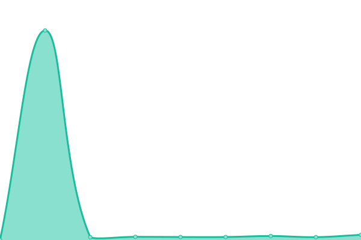

# [📈 Live Status](https://demo.upptime.js.org): <!--live status--> **🟩 All systems operational**

This repository contains the open-source uptime monitor and status page for [keviocastro](https://demo.upptime.js.org), powered by [Upptime](https://github.com/upptime/upptime).

With [Upptime](https://upptime.js.org), you can get your own unlimited and free uptime monitor and status page, powered entirely by a GitHub repository. We use [Issues](https://github.com/keviocastro/upptime/issues) as incident reports, [Actions](https://github.com/keviocastro/upptime/actions) as uptime monitors, and [Pages](https://demo.upptime.js.org) for the status page.

<!--start: status pages-->
<!-- This summary is generated by Upptime (https://github.com/upptime/upptime) -->
<!-- Do not edit this manually, your changes will be overwritten -->
<!-- prettier-ignore -->
| URL | Status | History | Response Time | Uptime |
| --- | ------ | ------- | ------------- | ------ |
|  [FX ACTIVE CAMPAIN (kty)](https://foxter-activecampaign.konecty.com) | 🟩 Up | [fx-active-campain-kty.yml](https://github.com/keviocastro/upptime/commits/HEAD/history/fx-active-campain-kty.yml) | 

 464ms
     
 | 

<a href="https://upptime.solidops.cloud/history/fx-active-campain-kty">100.00%</a>
    

|  [FX FLOWV2 (kty)](https://foxter-flows-v2.konecty.com) | 🟩 Up | [fx-flowv-2-kty.yml](https://github.com/keviocastro/upptime/commits/HEAD/history/fx-flowv-2-kty.yml) | 

 503ms
     
 | 

<a href="https://upptime.solidops.cloud/history/fx-flowv-2-kty">100.00%</a>
    

|  [FX MAILGUN (kty)](https://foxter-mailgun.konecty.com) | 🟩 Up | [fx-mailgun-kty.yml](https://github.com/keviocastro/upptime/commits/HEAD/history/fx-mailgun-kty.yml) | 

 338ms
     
 | 

<a href="https://upptime.solidops.cloud/history/fx-mailgun-kty">100.00%</a>
    

|  [FX PUSH (kty)](https://foxter-push.konecty.com) | 🟩 Up | [fx-push-kty.yml](https://github.com/keviocastro/upptime/commits/HEAD/history/fx-push-kty.yml) | 

 434ms
     
 | 

<a href="https://upptime.solidops.cloud/history/fx-push-kty">100.00%</a>
    

|  [FX INTEGRATIONS (kty)](https://foxter-integrations.konecty.com) | 🟩 Up | [fx-integrations-kty.yml](https://github.com/keviocastro/upptime/commits/HEAD/history/fx-integrations-kty.yml) | 

 1754ms
     
 | 

<a href="https://upptime.solidops.cloud/history/fx-integrations-kty">100.00%</a>
    

|  [FX file server (kty)](https://foxter-downloads.konecty.com) | 🟩 Up | [fx-file-server-kty.yml](https://github.com/keviocastro/upptime/commits/HEAD/history/fx-file-server-kty.yml) | 

 394ms
     
 | 

<a href="https://upptime.solidops.cloud/history/fx-file-server-kty">100.00%</a>
    

|  FX SOCIAL LINK (kty) | 🟩 Up | [fx-social-link-kty.yml](https://github.com/keviocastro/upptime/commits/HEAD/history/fx-social-link-kty.yml) | 

 422ms
     
 | 

<a href="https://upptime.solidops.cloud/history/fx-social-link-kty">100.00%</a>
    

|  [FX ALPHA API (kty)](https://alpha-api.foxterciaimobiliaria.com.br) | 🟩 Up | [fx-alpha-api-kty.yml](https://github.com/keviocastro/upptime/commits/HEAD/history/fx-alpha-api-kty.yml) | 

 526ms
     
 | 

<a href="https://upptime.solidops.cloud/history/fx-alpha-api-kty">100.00%</a>
    

|  [FX ALPHA (kty)](https://alpha.foxterciaimobiliaria.com.br) | 🟩 Up | [fx-alpha-kty.yml](https://github.com/keviocastro/upptime/commits/HEAD/history/fx-alpha-kty.yml) | 

 5449ms
     
 | 

<a href="https://upptime.solidops.cloud/history/fx-alpha-kty">100.00%</a>
    

|  [FX](https://foxter-atendimento.konecty.com) | 🟩 Up | [fx.yml](https://github.com/keviocastro/upptime/commits/HEAD/history/fx.yml) | 

 799ms
     
 | 

<a href="https://upptime.solidops.cloud/history/fx">100.00%</a>
    

|  [FX](https://rocketchat.foxter.konecty.com) | 🟩 Up | [fx.yml](https://github.com/keviocastro/upptime/commits/HEAD/history/fx.yml) | 

 799ms
     
 | 

<a href="https://upptime.solidops.cloud/history/fx">100.00%</a>
    

|  [FX](https://ofertaativa.foxterciaimobiliaria.com.br) | 🟩 Up | [fx.yml](https://github.com/keviocastro/upptime/commits/HEAD/history/fx.yml) | 

 799ms
     
 | 

<a href="https://upptime.solidops.cloud/history/fx">100.00%</a>
    

|  [FX](https://foxter-apps.konecty.com) | 🟩 Up | [fx.yml](https://github.com/keviocastro/upptime/commits/HEAD/history/fx.yml) | 

 799ms
     
 | 

<a href="https://upptime.solidops.cloud/history/fx">100.00%</a>
    

|  [FX](https://foxter.konecty.com) | 🟩 Up | [fx.yml](https://github.com/keviocastro/upptime/commits/HEAD/history/fx.yml) | 

 799ms
     
 | 

<a href="https://upptime.solidops.cloud/history/fx">100.00%</a>
    

|  [FX](https://foxter-hom.konecty.com) | 🟩 Up | [fx.yml](https://github.com/keviocastro/upptime/commits/HEAD/history/fx.yml) | 

 799ms
     
 | 

<a href="https://upptime.solidops.cloud/history/fx">100.00%</a>
    

|  [FX](https://amp.perdigueiroimoveis.com.br) | 🟩 Up | [fx.yml](https://github.com/keviocastro/upptime/commits/HEAD/history/fx.yml) | 

 799ms
     
 | 

<a href="https://upptime.solidops.cloud/history/fx">100.00%</a>
    

|  [FX](https://perdigueiroimoveis.com.br) | 🟩 Up | [fx.yml](https://github.com/keviocastro/upptime/commits/HEAD/history/fx.yml) | 

 799ms
     
 | 

<a href="https://upptime.solidops.cloud/history/fx">100.00%</a>
    

|  [FX portal](https://festivalfoxter.com.br) | 🟩 Up | [fx-portal.yml](https://github.com/keviocastro/upptime/commits/HEAD/history/fx-portal.yml) | 

 5516ms
     
 | 

<a href="https://upptime.solidops.cloud/history/fx-portal">100.00%</a>
    

|  [FX portal](https://megafestivalfoxter.com.br) | 🟩 Up | [fx-portal.yml](https://github.com/keviocastro/upptime/commits/HEAD/history/fx-portal.yml) | 

 5516ms
     
 | 

<a href="https://upptime.solidops.cloud/history/fx-portal">100.00%</a>
    

|  [FX portal](https://foxterciaimobiliaria.com.br) | 🟩 Up | [fx-portal.yml](https://github.com/keviocastro/upptime/commits/HEAD/history/fx-portal.yml) | 

 5516ms
     
 | 

<a href="https://upptime.solidops.cloud/history/fx-portal">100.00%</a>
    

|  [FX portal](https://foxterciaimobiliaria.com.br) | 🟩 Up | [fx-portal.yml](https://github.com/keviocastro/upptime/commits/HEAD/history/fx-portal.yml) | 

 5516ms
     
 | 

<a href="https://upptime.solidops.cloud/history/fx-portal">100.00%</a>
    

|  [FX portal api](https://api.foxterciaimobiliaria.com.br) | 🟩 Up | [fx-portal-api.yml](https://github.com/keviocastro/upptime/commits/HEAD/history/fx-portal-api.yml) | 

 473ms
     
 | 

<a href="https://upptime.solidops.cloud/history/fx-portal-api">100.00%</a>
    

|  [FX conteudos pages](https://lancamentos.foxterciaimobiliaria.com.br) | 🟩 Up | [fx-conteudos-pages.yml](https://github.com/keviocastro/upptime/commits/HEAD/history/fx-conteudos-pages.yml) | 

 1721ms
     
 | 

<a href="https://upptime.solidops.cloud/history/fx-conteudos-pages">99.87%</a>
    

|  [FX conteudos pages](https://investimentos.foxterciaimobiliaria.com.br) | 🟩 Up | [fx-conteudos-pages.yml](https://github.com/keviocastro/upptime/commits/HEAD/history/fx-conteudos-pages.yml) | 

 1721ms
     
 | 

<a href="https://upptime.solidops.cloud/history/fx-conteudos-pages">99.87%</a>
    

|  [FX conteudos pages](https://conteudos.foxterciaimobiliaria.com.br) | 🟩 Up | [fx-conteudos-pages.yml](https://github.com/keviocastro/upptime/commits/HEAD/history/fx-conteudos-pages.yml) | 

 1721ms
     
 | 

<a href="https://upptime.solidops.cloud/history/fx-conteudos-pages">99.87%</a>
    

|  [FX conteudos pages](https://financiamento.foxterciaimobiliaria.com.br) | 🟩 Up | [fx-conteudos-pages.yml](https://github.com/keviocastro/upptime/commits/HEAD/history/fx-conteudos-pages.yml) | 

 1721ms
     
 | 

<a href="https://upptime.solidops.cloud/history/fx-conteudos-pages">99.87%</a>
    

|  [FX corretor](https://conexao.foxterciaimobiliaria.com.br) | 🟩 Up | [fx-corretor.yml](https://github.com/keviocastro/upptime/commits/HEAD/history/fx-corretor.yml) | 

 6420ms
     
 | 

<a href="https://upptime.solidops.cloud/history/fx-corretor">100.00%</a>
    

|  [FX corretor](https://corretores.foxterciaimobiliaria.com.br) | 🟩 Up | [fx-corretor.yml](https://github.com/keviocastro/upptime/commits/HEAD/history/fx-corretor.yml) | 

 6420ms
     
 | 

<a href="https://upptime.solidops.cloud/history/fx-corretor">100.00%</a>
    

|  [FX net](https://foxter.net.br) | 🟩 Up | [fx-net.yml](https://github.com/keviocastro/upptime/commits/HEAD/history/fx-net.yml) | 

 348ms
     
 | 

<a href="https://upptime.solidops.cloud/history/fx-net">100.00%</a>
    

|  [FX net](https://novidadeimobiliaria.com.br) | 🟩 Up | [fx-net.yml](https://github.com/keviocastro/upptime/commits/HEAD/history/fx-net.yml) | 

 348ms
     
 | 

<a href="https://upptime.solidops.cloud/history/fx-net">100.00%</a>
    

|  [FX net](https://novidadeimobiliaria.com.br) | 🟩 Up | [fx-net.yml](https://github.com/keviocastro/upptime/commits/HEAD/history/fx-net.yml) | 

 348ms
     
 | 

<a href="https://upptime.solidops.cloud/history/fx-net">100.00%</a>
    

<!--end: status pages-->

[**Visit our status website →**](https://demo.upptime.js.org)

## 📄 License

- Powered by: [Upptime](https://github.com/upptime/upptime)
- Code: [MIT](./LICENSE) © [keviocastro](https://demo.upptime.js.org)
- Data in the `./history` directory: [Open Database License](https://opendatacommons.org/licenses/odbl/1-0/)
