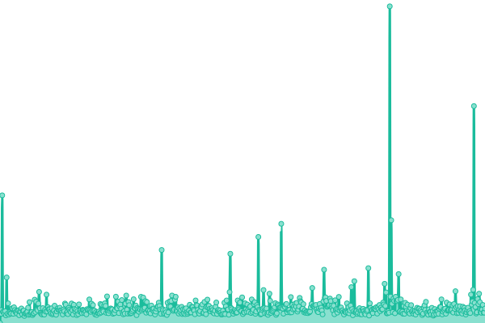

# [📈 Live Status](https://demo.upptime.js.org): <!--live status--> **🟧 Partial outage**

This repository contains the open-source uptime monitor and status page for [keviocastro](https://demo.upptime.js.org), powered by [Upptime](https://github.com/upptime/upptime).

With [Upptime](https://upptime.js.org), you can get your own unlimited and free uptime monitor and status page, powered entirely by a GitHub repository. We use [Issues](https://github.com/keviocastro/upptime/issues) as incident reports, [Actions](https://github.com/keviocastro/upptime/actions) as uptime monitors, and [Pages](https://demo.upptime.js.org) for the status page.

<!--start: status pages-->
<!-- This summary is generated by Upptime (https://github.com/upptime/upptime) -->
<!-- Do not edit this manually, your changes will be overwritten -->
<!-- prettier-ignore -->
| URL | Status | History | Response Time | Uptime |
| --- | ------ | ------- | ------------- | ------ |
|  [ky sicesp conpcd](conexaopcd.com.br) | 🟩 Up | [ky-sicesp-conpcd.yml](https://github.com/keviocastro/upptime/commits/HEAD/history/ky-sicesp-conpcd.yml) | 

 7829ms
     
 | 

<a href="https://upptime.solidops.cloud/history/ky-sicesp-conpcd">100.00%</a>
    

|  [ky sicesp ky](sinicesp.konecty.com) | 🟩 Up | [ky-sicesp-ky.yml](https://github.com/keviocastro/upptime/commits/HEAD/history/ky-sicesp-ky.yml) | 

 364ms
     
 | 

<a href="https://upptime.solidops.cloud/history/ky-sicesp-ky">100.00%</a>
    

|  [FX blog (kty)](https://blog.foxterciaimobiliaria.com.br) | 🟥 Down | [fx-blog-kty.yml](https://github.com/keviocastro/upptime/commits/HEAD/history/fx-blog-kty.yml) | 

 874ms
     
 | 

<a href="https://upptime.solidops.cloud/history/fx-blog-kty">68.41%</a>
    

|  [FX blog (kty)](https://foxter-blogeditor.konecty.com) | 🟥 Down | [fx-blog-kty.yml](https://github.com/keviocastro/upptime/commits/HEAD/history/fx-blog-kty.yml) | 

 875ms
     
 | 

<a href="https://upptime.solidops.cloud/history/fx-blog-kty">68.41%</a>
    

|  [FX ACTIVE CAMPAIN (kty)](https://foxter-activecampaign.konecty.com) | 🟩 Up | [fx-active-campain-kty.yml](https://github.com/keviocastro/upptime/commits/HEAD/history/fx-active-campain-kty.yml) | 

 431ms
     
 | 

<a href="https://upptime.solidops.cloud/history/fx-active-campain-kty">81.52%</a>
    

|  [FX FLOWV2 (kty)](https://foxter-flows-v2.konecty.com) | 🟩 Up | [fx-flowv-2-kty.yml](https://github.com/keviocastro/upptime/commits/HEAD/history/fx-flowv-2-kty.yml) | 

 477ms
     
 | 

<a href="https://upptime.solidops.cloud/history/fx-flowv-2-kty">18.91%</a>
    

|  [FX MAILGUN (kty)](https://foxter-mailgun.konecty.com) | 🟩 Up | [fx-mailgun-kty.yml](https://github.com/keviocastro/upptime/commits/HEAD/history/fx-mailgun-kty.yml) | 

 302ms
     
 | 

<a href="https://upptime.solidops.cloud/history/fx-mailgun-kty">0.00%</a>
    

|  [FX PUSH (kty)](https://foxter-push.konecty.com) | 🟥 Down | [fx-push-kty.yml](https://github.com/keviocastro/upptime/commits/HEAD/history/fx-push-kty.yml) | 

 164ms
     
 | 

<a href="https://upptime.solidops.cloud/history/fx-push-kty">0.00%</a>
    

|  [FX oportunity (kty)](https://foxter-opportunity-api.konecty.com/liveness) | 🟩 Up | [fx-oportunity-kty.yml](https://github.com/keviocastro/upptime/commits/HEAD/history/fx-oportunity-kty.yml) | 

 427ms
     
 | 

<a href="https://upptime.solidops.cloud/history/fx-oportunity-kty">100.00%</a>
    

|  [FX ALPHA API (kty)](https://alpha-api.foxterciaimobiliaria.com.br) | 🟥 Down | [fx-alpha-api-kty.yml](https://github.com/keviocastro/upptime/commits/HEAD/history/fx-alpha-api-kty.yml) | 

 408ms
     
 | 

<a href="https://upptime.solidops.cloud/history/fx-alpha-api-kty">0.00%</a>
    

|  [FX ALPHA (kty)](https://alpha.foxterciaimobiliaria.com.br) | 🟩 Up | [fx-alpha-kty.yml](https://github.com/keviocastro/upptime/commits/HEAD/history/fx-alpha-kty.yml) | 

 582ms
     
 | 

<a href="https://upptime.solidops.cloud/history/fx-alpha-kty">0.00%</a>
    

|  [FX atendimento (kty)](https://foxter-atendimento.konecty.com) | 🟩 Up | [fx-atendimento-kty.yml](https://github.com/keviocastro/upptime/commits/HEAD/history/fx-atendimento-kty.yml) | 

 239ms
     
 | 

<a href="https://upptime.solidops.cloud/history/fx-atendimento-kty">100.00%</a>
    

|  [FX rocket (kty)](https://rocketchat.foxter.konecty.com) | 🟩 Up | [fx-rocket-kty.yml](https://github.com/keviocastro/upptime/commits/HEAD/history/fx-rocket-kty.yml) | 

 632ms
     
 | 

<a href="https://upptime.solidops.cloud/history/fx-rocket-kty">99.58%</a>
    

|  [FX oferta (kty)](https://ofertaativa.foxterciaimobiliaria.com.br) | 🟥 Down | [fx-oferta-kty.yml](https://github.com/keviocastro/upptime/commits/HEAD/history/fx-oferta-kty.yml) | 

 344ms
     
 | 

<a href="https://upptime.solidops.cloud/history/fx-oferta-kty">0.00%</a>
    

|  [FX apps (kty)](https://foxter-apps.konecty.com) | 🟩 Up | [fx-apps-kty.yml](https://github.com/keviocastro/upptime/commits/HEAD/history/fx-apps-kty.yml) | 

 274ms
     
 | 

<a href="https://upptime.solidops.cloud/history/fx-apps-kty">100.00%</a>
    

|  [FX kty (kty)](https://foxter.konecty.com) | 🟩 Up | [fx-kty-kty.yml](https://github.com/keviocastro/upptime/commits/HEAD/history/fx-kty-kty.yml) | 

 443ms
     
 | 

<a href="https://upptime.solidops.cloud/history/fx-kty-kty">100.00%</a>
    

|  [FX kty hom (kty)](https://foxter-hom.konecty.com) | 🟥 Down | [fx-kty-hom-kty.yml](https://github.com/keviocastro/upptime/commits/HEAD/history/fx-kty-hom-kty.yml) | 

 168ms
     
 | 

<a href="https://upptime.solidops.cloud/history/fx-kty-hom-kty">0.00%</a>
    

|  [FX portal 3 (kty)](https://foxterciaimobiliaria.com.br) | 🟩 Up | [fx-portal-3-kty.yml](https://github.com/keviocastro/upptime/commits/HEAD/history/fx-portal-3-kty.yml) | 

 196ms
     
 | 

<a href="https://upptime.solidops.cloud/history/fx-portal-3-kty">100.00%</a>
    

|  [FX portal 4 (kty)](https://foxterciaimobiliaria.com.br) | 🟩 Up | [fx-portal-4-kty.yml](https://github.com/keviocastro/upptime/commits/HEAD/history/fx-portal-4-kty.yml) | 

 17ms
     
 | 

<a href="https://upptime.solidops.cloud/history/fx-portal-4-kty">100.00%</a>
    

|  [FX portal api (kty)](https://api.foxterciaimobiliaria.com.br) | 🟥 Down | [fx-portal-api-kty.yml](https://github.com/keviocastro/upptime/commits/HEAD/history/fx-portal-api-kty.yml) | 

 342ms
     
 | 

<a href="https://upptime.solidops.cloud/history/fx-portal-api-kty">100.00%</a>
    

|  [FX conteudos pages 4 (kty)](https://financiamento.foxterciaimobiliaria.com.br) | 🟥 Down | [fx-conteudos-pages-4-kty.yml](https://github.com/keviocastro/upptime/commits/HEAD/history/fx-conteudos-pages-4-kty.yml) | 

 0ms
     
 | 

<a href="https://upptime.solidops.cloud/history/fx-conteudos-pages-4-kty">0.00%</a>
    

|  [FX corretor (kty)](https://conexao.foxterciaimobiliaria.com.br) | 🟥 Down | [fx-corretor-kty.yml](https://github.com/keviocastro/upptime/commits/HEAD/history/fx-corretor-kty.yml) | 

 155ms
     
 | 

<a href="https://upptime.solidops.cloud/history/fx-corretor-kty">68.27%</a>
    

|  [FX corretor (kty)](https://corretores.foxterciaimobiliaria.com.br) | 🟥 Down | [fx-corretor-kty.yml](https://github.com/keviocastro/upptime/commits/HEAD/history/fx-corretor-kty.yml) | 

 155ms
     
 | 

<a href="https://upptime.solidops.cloud/history/fx-corretor-kty">68.27%</a>
    

|  [FX novidade (kty)](https://novidadeimobiliaria.com.br) | 🟩 Up | [fx-novidade-kty.yml](https://github.com/keviocastro/upptime/commits/HEAD/history/fx-novidade-kty.yml) | 

 294ms
     
 | 

<a href="https://upptime.solidops.cloud/history/fx-novidade-kty">100.00%</a>
    

|  [AVS chat (kty)](https://chat.avus.com.br) | 🟩 Up | [avs-chat-kty.yml](https://github.com/keviocastro/upptime/commits/HEAD/history/avs-chat-kty.yml) | 

 380ms
     
 | 

<a href="https://upptime.solidops.cloud/history/avs-chat-kty">100.00%</a>
    

|  [AVS kty (kty)](https://avus.konecty.com) | 🟩 Up | [avs-kty-kty.yml](https://github.com/keviocastro/upptime/commits/HEAD/history/avs-kty-kty.yml) | 

 359ms
     
 | 

<a href="https://upptime.solidops.cloud/history/avs-kty-kty">100.00%</a>
    

|  [AVS api  (kty)](https://api.avus.com.br) | 🟩 Up | [avs-api-kty.yml](https://github.com/keviocastro/upptime/commits/HEAD/history/avs-api-kty.yml) | 

 319ms
     
 | 

<a href="https://upptime.solidops.cloud/history/avs-api-kty">100.00%</a>
    

|  [AVS push api  (kty)](https://push-api.avus.com.br) | 🟩 Up | [avs-push-api-kty.yml](https://github.com/keviocastro/upptime/commits/HEAD/history/avs-push-api-kty.yml) | 

 329ms
     
 | 

<a href="https://upptime.solidops.cloud/history/avs-push-api-kty">0.00%</a>
    

|  [AVS services  (NodeRed)](https://servicos.avus.com.br) | 🟩 Up | [avs-services-node-red.yml](https://github.com/keviocastro/upptime/commits/HEAD/history/avs-services-node-red.yml) | 

 252ms
     
 | 

<a href="https://upptime.solidops.cloud/history/avs-services-node-red">100.00%</a>
    

|  [AVS (kty)](https://avus.com.br) | 🟩 Up | [avs-kty.yml](https://github.com/keviocastro/upptime/commits/HEAD/history/avs-kty.yml) | 

 7440ms
     
 | 

<a href="https://upptime.solidops.cloud/history/avs-kty">0.00%</a>
    

|  [AVS card (kty)](https://pancorretora.avus.com.br) | 🟩 Up | [avs-card-kty.yml](https://github.com/keviocastro/upptime/commits/HEAD/history/avs-card-kty.yml) | 

 6449ms
     
 | 

<a href="https://upptime.solidops.cloud/history/avs-card-kty">100.00%</a>
    

|  [AVS rgsp (kty)](https://rgsp.avus.com.br) | 🟥 Down | [avs-rgsp-kty.yml](https://github.com/keviocastro/upptime/commits/HEAD/history/avs-rgsp-kty.yml) | 

 187ms
     
 | 

<a href="https://upptime.solidops.cloud/history/avs-rgsp-kty">0.00%</a>
    

|  [AVS too (kty)](https://too.avus.com.br) | 🟩 Up | [avs-too-kty.yml](https://github.com/keviocastro/upptime/commits/HEAD/history/avs-too-kty.yml) | 

 6459ms
     
 | 

<a href="https://upptime.solidops.cloud/history/avs-too-kty">100.00%</a>
    

|  [AVS app (kty)](https://app.avus.com.br) | 🟩 Up | [avs-app-kty.yml](https://github.com/keviocastro/upptime/commits/HEAD/history/avs-app-kty.yml) | 

 115ms
     
 | 

<a href="https://upptime.solidops.cloud/history/avs-app-kty">100.00%</a>
    

|  [zuk kty (kty)](https://zuckhan.konecty.com) | 🟩 Up | [zuk-kty-kty.yml](https://github.com/keviocastro/upptime/commits/HEAD/history/zuk-kty-kty.yml) | 

 194ms
     
 | 

<a href="https://upptime.solidops.cloud/history/zuk-kty-kty">100.00%</a>
    

|  [zuk site (kty)](https://zuckhan.com.br) | 🟩 Up | [zuk-site-kty.yml](https://github.com/keviocastro/upptime/commits/HEAD/history/zuk-site-kty.yml) | 

 6624ms
     
 | 

<a href="https://upptime.solidops.cloud/history/zuk-site-kty">100.00%</a>
    

|  [urba blog guaiabapark (kty)](https://blogguaibapark.urbacon.com.br) | 🟩 Up | [urba-blog-guaiabapark-kty.yml](https://github.com/keviocastro/upptime/commits/HEAD/history/urba-blog-guaiabapark-kty.yml) | 

 1174ms
     
 | 

<a href="https://upptime.solidops.cloud/history/urba-blog-guaiabapark-kty">100.00%</a>
    

|  [urba blog editor guaibapark (kty)](https://blogeditorguaibapark.urbacon.com.br) | 🟩 Up | [urba-blog-editor-guaibapark-kty.yml](https://github.com/keviocastro/upptime/commits/HEAD/history/urba-blog-editor-guaibapark-kty.yml) | 

 1039ms
     
 | 

<a href="https://upptime.solidops.cloud/history/urba-blog-editor-guaibapark-kty">100.00%</a>
    

|  [urba blog (kty)](https://blog.urbacon.com.br) | 🟩 Up | [urba-blog-kty.yml](https://github.com/keviocastro/upptime/commits/HEAD/history/urba-blog-kty.yml) | 

 854ms
     
 | 

<a href="https://upptime.solidops.cloud/history/urba-blog-kty">100.00%</a>
    

|  [urba blog editor (kty)](https://urbacon-blogeditor.konecty.com) | 🟩 Up | [urba-blog-editor-kty.yml](https://github.com/keviocastro/upptime/commits/HEAD/history/urba-blog-editor-kty.yml) | 

 153ms
     
 | 

<a href="https://upptime.solidops.cloud/history/urba-blog-editor-kty">100.00%</a>
    

|  [urba chat (kty)](https://chat.urbacon.com.br) | 🟩 Up | [urba-chat-kty.yml](https://github.com/keviocastro/upptime/commits/HEAD/history/urba-chat-kty.yml) | 

 764ms
     
 | 

<a href="https://upptime.solidops.cloud/history/urba-chat-kty">100.00%</a>
    

|  [urba atendimento (kty)](https://atendimento-urbacon.konecty.com) | 🟩 Up | [urba-atendimento-kty.yml](https://github.com/keviocastro/upptime/commits/HEAD/history/urba-atendimento-kty.yml) | 

 233ms
     
 | 

<a href="https://upptime.solidops.cloud/history/urba-atendimento-kty">100.00%</a>
    

|  [urba integration (kty)](https://urbacon-integrations.konecty.com) | 🟩 Up | [urba-integration-kty.yml](https://github.com/keviocastro/upptime/commits/HEAD/history/urba-integration-kty.yml) | 

 141ms
     
 | 

<a href="https://upptime.solidops.cloud/history/urba-integration-kty">100.00%</a>
    

|  [urba kty (kty)](https://urbacon.konecty.com) | 🟩 Up | [urba-kty-kty.yml](https://github.com/keviocastro/upptime/commits/HEAD/history/urba-kty-kty.yml) | 

 193ms
     
 | 

<a href="https://upptime.solidops.cloud/history/urba-kty-kty">100.00%</a>
    

|  [urba site (kty)](https://urbacon.com.br) | 🟩 Up | [urba-site-kty.yml](https://github.com/keviocastro/upptime/commits/HEAD/history/urba-site-kty.yml) | 

 466ms
     
 | 

<a href="https://upptime.solidops.cloud/history/urba-site-kty">100.00%</a>
    

|  [maedeuz kty  (kty)](https://maededeus.konecty.com) | 🟩 Up | [maedeuz-kty-kty.yml](https://github.com/keviocastro/upptime/commits/HEAD/history/maedeuz-kty-kty.yml) | 

 252ms
     
 | 

<a href="https://upptime.solidops.cloud/history/maedeuz-kty-kty">100.00%</a>
    

|  [krystal kty (kty)](https://krystal.konecty.com) | 🟥 Down | [krystal-kty-kty.yml](https://github.com/keviocastro/upptime/commits/HEAD/history/krystal-kty-kty.yml) | 

 168ms
     
 | 

<a href="https://upptime.solidops.cloud/history/krystal-kty-kty">0.00%</a>
    

|  [krystal site (kty)](https://krystal.com.br) | 🟩 Up | [krystal-site-kty.yml](https://github.com/keviocastro/upptime/commits/HEAD/history/krystal-site-kty.yml) | 

 1098ms
     
 | 

<a href="https://upptime.solidops.cloud/history/krystal-site-kty">100.00%</a>
    

|  [savar kty (kty)](https://gruposavar.konecty.com) | 🟩 Up | [savar-kty-kty.yml](https://github.com/keviocastro/upptime/commits/HEAD/history/savar-kty-kty.yml) | 

 208ms
     
 | 

<a href="https://upptime.solidops.cloud/history/savar-kty-kty">100.00%</a>
    

|  [savar site (kty)](https://gruposavar.com.br) | 🟩 Up | [savar-site-kty.yml](https://github.com/keviocastro/upptime/commits/HEAD/history/savar-site-kty.yml) | 

 554ms
     
 | 

<a href="https://upptime.solidops.cloud/history/savar-site-kty">100.00%</a>
    

|  [Ca park adm (kty)](https://canoaspark.urbacon.com.br/admin) | 🟩 Up | [ca-park-adm-kty.yml](https://github.com/keviocastro/upptime/commits/HEAD/history/ca-park-adm-kty.yml) | 

 896ms
     
 | 

<a href="https://upptime.solidops.cloud/history/ca-park-adm-kty">100.00%</a>
    

|  [Ca park simulator (kty)](https://canoaspark.urbacon.com.br/simulador) | 🟩 Up | [ca-park-simulator-kty.yml](https://github.com/keviocastro/upptime/commits/HEAD/history/ca-park-simulator-kty.yml) | 

 8359ms
     
 | 

<a href="https://upptime.solidops.cloud/history/ca-park-simulator-kty">0.00%</a>
    

|  [esquadria atendiemnto (kty)](https://atendimento-prata.konecty.com) | 🟩 Up | [esquadria-atendiemnto-kty.yml](https://github.com/keviocastro/upptime/commits/HEAD/history/esquadria-atendiemnto-kty.yml) | 

 158ms
     
 | 

<a href="https://upptime.solidops.cloud/history/esquadria-atendiemnto-kty">100.00%</a>
    

|  [esquadria kty (kty)](https://esquadriasprata.konecty.com) | 🟩 Up | [esquadria-kty-kty.yml](https://github.com/keviocastro/upptime/commits/HEAD/history/esquadria-kty-kty.yml) | 

 213ms
     
 | 

<a href="https://upptime.solidops.cloud/history/esquadria-kty-kty">100.00%</a>
    

|  [ky egali api](https://api.egalite.com.br) | 🟩 Up | [ky-egali-api.yml](https://github.com/keviocastro/upptime/commits/HEAD/history/ky-egali-api.yml) | 

 307ms
     
 | 

<a href="https://upptime.solidops.cloud/history/ky-egali-api">100.00%</a>
    

|  [egali empresa (kty)](https://empresa.incluipcd.com.br/admin) | 🟩 Up | [egali-empresa-kty.yml](https://github.com/keviocastro/upptime/commits/HEAD/history/egali-empresa-kty.yml) | 

 610ms
     
 | 

<a href="https://upptime.solidops.cloud/history/egali-empresa-kty">100.00%</a>
    

|  [egali blog edtior (kty)](https://egalite-blogeditor.konecty.com) | 🟥 Down | [egali-blog-edtior-kty.yml](https://github.com/keviocastro/upptime/commits/HEAD/history/egali-blog-edtior-kty.yml) | 

 142ms
     
 | 

<a href="https://upptime.solidops.cloud/history/egali-blog-edtior-kty">0.00%</a>
    

|  [egali kty (kty)](https://egalite.konecty.com) | 🟩 Up | [egali-kty-kty.yml](https://github.com/keviocastro/upptime/commits/HEAD/history/egali-kty-kty.yml) | 

 226ms
     
 | 

<a href="https://upptime.solidops.cloud/history/egali-kty-kty">0.00%</a>
    

|  [egali flows (kty)](https://egalite-flows.konecty.com) | 🟩 Up | [egali-flows-kty.yml](https://github.com/keviocastro/upptime/commits/HEAD/history/egali-flows-kty.yml) | 

 141ms
     
 | 

<a href="https://upptime.solidops.cloud/history/egali-flows-kty">100.00%</a>
    

|  [egali site (kty)](https://egalite.com.br) | 🟩 Up | [egali-site-kty.yml](https://github.com/keviocastro/upptime/commits/HEAD/history/egali-site-kty.yml) | 

 466ms
     
 | 

<a href="https://upptime.solidops.cloud/history/egali-site-kty">100.00%</a>
    

|  [egali incluipcd (kty)](https://incluipcd.com.br) | 🟩 Up | [egali-incluipcd-kty.yml](https://github.com/keviocastro/upptime/commits/HEAD/history/egali-incluipcd-kty.yml) | 

 168ms
     
 | 

<a href="https://upptime.solidops.cloud/history/egali-incluipcd-kty">100.00%</a>
    

|  [egali pcdbrasil (kty)](https://pcdbrasil.com.br) | 🟩 Up | [egali-pcdbrasil-kty.yml](https://github.com/keviocastro/upptime/commits/HEAD/history/egali-pcdbrasil-kty.yml) | 

 6145ms
     
 | 

<a href="https://upptime.solidops.cloud/history/egali-pcdbrasil-kty">100.00%</a>
    

|  [egali rumo (kty)](https://rumo.konecty.com) | 🟥 Down | [egali-rumo-kty.yml](https://github.com/keviocastro/upptime/commits/HEAD/history/egali-rumo-kty.yml) | 

 137ms
     
 | 

<a href="https://upptime.solidops.cloud/history/egali-rumo-kty">0.00%</a>
    

|  [davog kty (kty)](https://davoglio.konecty.com) | 🟩 Up | [davog-kty-kty.yml](https://github.com/keviocastro/upptime/commits/HEAD/history/davog-kty-kty.yml) | 

 360ms
     
 | 

<a href="https://upptime.solidops.cloud/history/davog-kty-kty">100.00%</a>
    

|  [davog representante (kty)](https://representantes.davoglio.konecty.com/) | 🟩 Up | [davog-representante-kty.yml](https://github.com/keviocastro/upptime/commits/HEAD/history/davog-representante-kty.yml) | 

 212ms
     
 | 

<a href="https://upptime.solidops.cloud/history/davog-representante-kty">100.00%</a>
    

|  [elagi konecty (kty)](https://egalite.konecty.com) | 🟩 Up | [elagi-konecty-kty.yml](https://github.com/keviocastro/upptime/commits/HEAD/history/elagi-konecty-kty.yml) | 

 235ms
     
 | 

<a href="https://upptime.solidops.cloud/history/elagi-konecty-kty">100.00%</a>
    

|  [elagi pcbr (kty)](https://pcdbrasil.com.br) | 🟩 Up | [elagi-pcbr-kty.yml](https://github.com/keviocastro/upptime/commits/HEAD/history/elagi-pcbr-kty.yml) | 

 5757ms
     
 | 

<a href="https://upptime.solidops.cloud/history/elagi-pcbr-kty">100.00%</a>
    

|  [elagi incpcd (kty)](https://incluipcd.com.br) | 🟩 Up | [elagi-incpcd-kty.yml](https://github.com/keviocastro/upptime/commits/HEAD/history/elagi-incpcd-kty.yml) | 

 189ms
     
 | 

<a href="https://upptime.solidops.cloud/history/elagi-incpcd-kty">100.00%</a>
    

|  [elagi (kty)](https://egalite.com.br) | 🟩 Up | [elagi-kty.yml](https://github.com/keviocastro/upptime/commits/HEAD/history/elagi-kty.yml) | 

 188ms
     
 | 

<a href="https://upptime.solidops.cloud/history/elagi-kty">100.00%</a>
    

|  [elagi (kty)](https://egalite.com.br) | 🟩 Up | [elagi-kty.yml](https://github.com/keviocastro/upptime/commits/HEAD/history/elagi-kty.yml) | 

 188ms
     
 | 

<a href="https://upptime.solidops.cloud/history/elagi-kty">100.00%</a>
    

|  [egali flows (kty)](https://egalite-flows.konecty.com) | 🟩 Up | [egali-flows-kty.yml](https://github.com/keviocastro/upptime/commits/HEAD/history/egali-flows-kty.yml) | 

 141ms
     
 | 

<a href="https://upptime.solidops.cloud/history/egali-flows-kty">100.00%</a>
    

|  [egali beditor (kty)](https://egalite-blogeditor.konecty.com) | 🟥 Down | [egali-beditor-kty.yml](https://github.com/keviocastro/upptime/commits/HEAD/history/egali-beditor-kty.yml) | 

 106ms
     
 | 

<a href="https://upptime.solidops.cloud/history/egali-beditor-kty">0.00%</a>
    

|  [egali blog (kty)](https://blog.egalite.com.br) | 🟩 Up | [egali-blog-kty.yml](https://github.com/keviocastro/upptime/commits/HEAD/history/egali-blog-kty.yml) | 

 423ms
     
 | 

<a href="https://upptime.solidops.cloud/history/egali-blog-kty">100.00%</a>
    

|  [elagi-cl konecty (kty)](https://egalite-cl.konecty.com) | 🟩 Up | [elagi-cl-konecty-kty.yml](https://github.com/keviocastro/upptime/commits/HEAD/history/elagi-cl-konecty-kty.yml) | 

 180ms
     
 | 

<a href="https://upptime.solidops.cloud/history/elagi-cl-konecty-kty">100.00%</a>
    

|  [elagi-cl Portal (kty)](https://egalite.cl) | 🟥 Down | [elagi-cl-portal-kty.yml](https://github.com/keviocastro/upptime/commits/HEAD/history/elagi-cl-portal-kty.yml) | 

 0ms
     
 | 

<a href="https://upptime.solidops.cloud/history/elagi-cl-portal-kty">0.00%</a>
    

|  [elagi-cl API (kty)](https://api.egalite.cl) | 🟥 Down | [elagi-cl-api-kty.yml](https://github.com/keviocastro/upptime/commits/HEAD/history/elagi-cl-api-kty.yml) | 

 0ms
     
 | 

<a href="https://upptime.solidops.cloud/history/elagi-cl-api-kty">0.00%</a>
    

|  [kty site](https://konecty.com) | 🟩 Up | [kty-site.yml](https://github.com/keviocastro/upptime/commits/HEAD/history/kty-site.yml) | 

 6620ms
     
 | 

<a href="https://upptime.solidops.cloud/history/kty-site">100.00%</a>
    

|  [kty flows](https://flows.konecty.com) | 🟩 Up | [kty-flows.yml](https://github.com/keviocastro/upptime/commits/HEAD/history/kty-flows.yml) | 

 134ms
     
 | 

<a href="https://upptime.solidops.cloud/history/kty-flows">100.00%</a>
    

|  [kty kty](https://konecty.konecty.com) | 🟩 Up | [kty-kty.yml](https://github.com/keviocastro/upptime/commits/HEAD/history/kty-kty.yml) | 

 292ms
     
 | 

<a href="https://upptime.solidops.cloud/history/kty-kty">0.00%</a>
    

|  [kty esqu atendimento](https://atendimento-prata.konecty.com) | 🟩 Up | [kty-esqu-atendimento.yml](https://github.com/keviocastro/upptime/commits/HEAD/history/kty-esqu-atendimento.yml) | 

 119ms
     
 | 

<a href="https://upptime.solidops.cloud/history/kty-esqu-atendimento">100.00%</a>
    

|  [kty esqu api](https://esquadriasprata-api.konecty.com) | 🟩 Up | [kty-esqu-api.yml](https://github.com/keviocastro/upptime/commits/HEAD/history/kty-esqu-api.yml) | 

 126ms
     
 | 

<a href="https://upptime.solidops.cloud/history/kty-esqu-api">100.00%</a>
    

|  [kty esqu konecty](https://esquadriasprata.konecty.com/login) | 🟩 Up | [kty-esqu-konecty.yml](https://github.com/keviocastro/upptime/commits/HEAD/history/kty-esqu-konecty.yml) | 

 123ms
     
 | 

<a href="https://upptime.solidops.cloud/history/kty-esqu-konecty">100.00%</a>
    

|  [IEX app](https://api.comunidadeleo.com.br/auth/health) | 🟩 Up | [iex-app.yml](https://github.com/keviocastro/upptime/commits/HEAD/history/iex-app.yml) | 

 507ms
     
 | 

<a href="https://upptime.solidops.cloud/history/iex-app">100.00%</a>
    

|  [Portal tem poder quem age stie](https://comunidade.portaltempoderquemage.com.br) | 🟥 Down | [portal-tem-poder-quem-age-stie.yml](https://github.com/keviocastro/upptime/commits/HEAD/history/portal-tem-poder-quem-age-stie.yml) | 

 518ms
     
 | 

<a href="https://upptime.solidops.cloud/history/portal-tem-poder-quem-age-stie">0.00%</a>
    

|  [Portal tem poder quem age app](https://app.portaltempoderquemage.com.br) | 🟩 Up | [portal-tem-poder-quem-age-app.yml](https://github.com/keviocastro/upptime/commits/HEAD/history/portal-tem-poder-quem-age-app.yml) | 

 596ms
     
 | 

<a href="https://upptime.solidops.cloud/history/portal-tem-poder-quem-age-app">100.00%</a>
    

|  [Api - Portal tem poder quem age](https://api.portaltempoderquemage.com.br) | 🟩 Up | [api-portal-tem-poder-quem-age.yml](https://github.com/keviocastro/upptime/commits/HEAD/history/api-portal-tem-poder-quem-age.yml) | 

 415ms
     
 | 

<a href="https://upptime.solidops.cloud/history/api-portal-tem-poder-quem-age">0.00%</a>
    

|  [Ciscontinuum site](https://ciscontinuum.com.br) | 🟥 Down | [ciscontinuum-site.yml](https://github.com/keviocastro/upptime/commits/HEAD/history/ciscontinuum-site.yml) | 

 0ms
     
 | 

<a href="https://upptime.solidops.cloud/history/ciscontinuum-site">0.00%</a>
    

|  [Ciscontinuum app](https://app.ciscontinuum.com.br) | 🟥 Down | [ciscontinuum-app.yml](https://github.com/keviocastro/upptime/commits/HEAD/history/ciscontinuum-app.yml) | 

 0ms
     
 | 

<a href="https://upptime.solidops.cloud/history/ciscontinuum-app">0.00%</a>
    

|  [Ciscontinuum api](https://api.ciscontinuum.com.br) | 🟥 Down | [ciscontinuum-api.yml](https://github.com/keviocastro/upptime/commits/HEAD/history/ciscontinuum-api.yml) | 

 0ms
     
 | 

<a href="https://upptime.solidops.cloud/history/ciscontinuum-api">0.00%</a>
    

|  [Meu Social Post app](https://app.meusocialpost.app) | 🟩 Up | [meu-social-post-app.yml](https://github.com/keviocastro/upptime/commits/HEAD/history/meu-social-post-app.yml) | 

 267ms
     
 | 

<a href="https://upptime.solidops.cloud/history/meu-social-post-app">100.00%</a>
    

|  [Meu Social Post api](https://api.meusocialpost.app/auth/health) | 🟥 Down | [meu-social-post-api.yml](https://github.com/keviocastro/upptime/commits/HEAD/history/meu-social-post-api.yml) | 

 367ms
     
 | 

<a href="https://upptime.solidops.cloud/history/meu-social-post-api">0.00%</a>
    

|  [Oferta play site](https://minhaconta.ofertaplay.com.br) | 🟩 Up | [oferta-play-site.yml](https://github.com/keviocastro/upptime/commits/HEAD/history/oferta-play-site.yml) | 

 354ms
     
 | 

<a href="https://upptime.solidops.cloud/history/oferta-play-site">100.00%</a>
    

|  [Oferta play app](https://admin.ofertaplay.com.br) | 🟩 Up | [oferta-play-app.yml](https://github.com/keviocastro/upptime/commits/HEAD/history/oferta-play-app.yml) | 

 335ms
     
 | 

<a href="https://upptime.solidops.cloud/history/oferta-play-app">100.00%</a>
    

|  [Oferta play api](https://api.ofertaplay.com.br/oauth/health) | 🟩 Up | [oferta-play-api.yml](https://github.com/keviocastro/upptime/commits/HEAD/history/oferta-play-api.yml) | 

 610ms
     
 | 

<a href="https://upptime.solidops.cloud/history/oferta-play-api">100.00%</a>
    

|  [Simer pay site](https://simerpay.site.sensiconnect.io/minha-conta) | 🟩 Up | [simer-pay-site.yml](https://github.com/keviocastro/upptime/commits/HEAD/history/simer-pay-site.yml) | 

 521ms
     
 | 

<a href="https://upptime.solidops.cloud/history/simer-pay-site">100.00%</a>
    

|  [Simer pay app](https://simerpay.admin.sensiconnect.io) | 🟩 Up | [simer-pay-app.yml](https://github.com/keviocastro/upptime/commits/HEAD/history/simer-pay-app.yml) | 

 406ms
     
 | 

<a href="https://upptime.solidops.cloud/history/simer-pay-app">100.00%</a>
    

|  [Simer pay api](https://simerpay.api.sensiconnect.io/oauth/health) | 🟩 Up | [simer-pay-api.yml](https://github.com/keviocastro/upptime/commits/HEAD/history/simer-pay-api.yml) | 

 305ms
     
 | 

<a href="https://upptime.solidops.cloud/history/simer-pay-api">100.00%</a>
    

|  [Autoconect site](https://autoconect.com.br) | 🟩 Up | [autoconect-site.yml](https://github.com/keviocastro/upptime/commits/HEAD/history/autoconect-site.yml) | 

 1457ms
     
 | 

<a href="https://upptime.solidops.cloud/history/autoconect-site">100.00%</a>
    

|  [Autoconect api](https://api.autoconect.com.br) | 🟩 Up | [autoconect-api.yml](https://github.com/keviocastro/upptime/commits/HEAD/history/autoconect-api.yml) | 

 349ms
     
 | 

<a href="https://upptime.solidops.cloud/history/autoconect-api">100.00%</a>
    

|  [Autoconect app](https://admin.autoconect.com.br/login) | 🟥 Down | [autoconect-app.yml](https://github.com/keviocastro/upptime/commits/HEAD/history/autoconect-app.yml) | 

 581ms
     
 | 

<a href="https://upptime.solidops.cloud/history/autoconect-app">0.00%</a>
    

|  [GIPI billet](https://billet.app.gipisistemas.com.br/public/check/health) | 🟩 Up | [gipi-billet.yml](https://github.com/keviocastro/upptime/commits/HEAD/history/gipi-billet.yml) | 

 264ms
     
 | 

<a href="https://upptime.solidops.cloud/history/gipi-billet">88.44%</a>
    

|  [GIPI financial](https://financial.app.gipisistemas.com.br/public/check/health) | 🟩 Up | [gipi-financial.yml](https://github.com/keviocastro/upptime/commits/HEAD/history/gipi-financial.yml) | 

 281ms
     
 | 

<a href="https://upptime.solidops.cloud/history/gipi-financial">50.76%</a>
    

|  [GIPI oauth](https://oauth.app.gipisistemas.com.br/public/check/health) | 🟩 Up | [gipi-oauth.yml](https://github.com/keviocastro/upptime/commits/HEAD/history/gipi-oauth.yml) | 

 427ms
     
 | 

<a href="https://upptime.solidops.cloud/history/gipi-oauth">88.44%</a>
    

|  [GIPI app](https://app.gipisistemas.com.br) | 🟩 Up | [gipi-app.yml](https://github.com/keviocastro/upptime/commits/HEAD/history/gipi-app.yml) | 

 262ms
     
 | 

<a href="https://upptime.solidops.cloud/history/gipi-app">88.44%</a>
    

<!--end: status pages-->

[**Visit our status website →**](https://demo.upptime.js.org)

## 📄 License

- Powered by: [Upptime](https://github.com/upptime/upptime)
- Code: [MIT](./LICENSE) © [keviocastro](https://demo.upptime.js.org)
- Data in the `./history` directory: [Open Database License](https://opendatacommons.org/licenses/odbl/1-0/)
