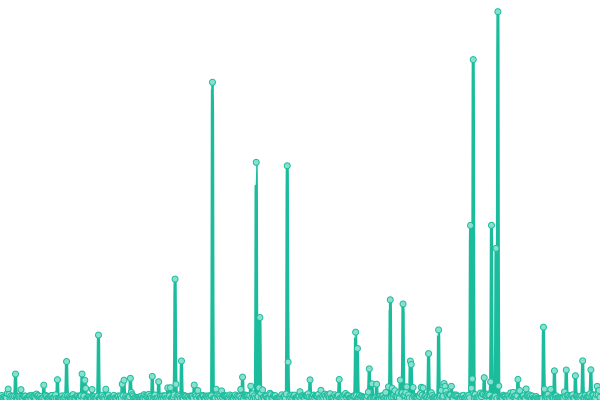

# [📈 Live Status](https://demo.upptime.js.org): <!--live status--> **🟧 Partial outage**

This repository contains the open-source uptime monitor and status page for [keviocastro](https://demo.upptime.js.org), powered by [Upptime](https://github.com/upptime/upptime).

With [Upptime](https://upptime.js.org), you can get your own unlimited and free uptime monitor and status page, powered entirely by a GitHub repository. We use [Issues](https://github.com/keviocastro/upptime/issues) as incident reports, [Actions](https://github.com/keviocastro/upptime/actions) as uptime monitors, and [Pages](https://demo.upptime.js.org) for the status page.

<!--start: status pages-->
<!-- This summary is generated by Upptime (https://github.com/upptime/upptime) -->
<!-- Do not edit this manually, your changes will be overwritten -->
<!-- prettier-ignore -->
| URL | Status | History | Response Time | Uptime |
| --- | ------ | ------- | ------------- | ------ |
|  [FX ACTIVE CAMPAIN (kty)](https://foxter-activecampaign.konecty.com) | 🟩 Up | [fx-active-campain-kty.yml](https://github.com/keviocastro/upptime/commits/HEAD/history/fx-active-campain-kty.yml) | 

 429ms
     
 | 

<a href="https://upptime.solidops.cloud/history/fx-active-campain-kty">100.00%</a>
    

|  [FX FLOWV2 (kty)](https://foxter-flows-v2.konecty.com) | 🟩 Up | [fx-flowv-2-kty.yml](https://github.com/keviocastro/upptime/commits/HEAD/history/fx-flowv-2-kty.yml) | 

 458ms
     
 | 

<a href="https://upptime.solidops.cloud/history/fx-flowv-2-kty">100.00%</a>
    

|  [FX MAILGUN (kty)](https://foxter-mailgun.konecty.com) | 🟩 Up | [fx-mailgun-kty.yml](https://github.com/keviocastro/upptime/commits/HEAD/history/fx-mailgun-kty.yml) | 

 381ms
     
 | 

<a href="https://upptime.solidops.cloud/history/fx-mailgun-kty">100.00%</a>
    

|  [FX PUSH (kty)](https://foxter-push.konecty.com) | 🟩 Up | [fx-push-kty.yml](https://github.com/keviocastro/upptime/commits/HEAD/history/fx-push-kty.yml) | 

 463ms
     
 | 

<a href="https://upptime.solidops.cloud/history/fx-push-kty">100.00%</a>
    

|  [FX INTEGRATIONS (kty)](https://foxter-integrations.konecty.com) | 🟩 Up | [fx-integrations-kty.yml](https://github.com/keviocastro/upptime/commits/HEAD/history/fx-integrations-kty.yml) | 

 868ms
     
 | 

<a href="https://upptime.solidops.cloud/history/fx-integrations-kty">100.00%</a>
    

|  [FX file server (kty)](https://foxter-downloads.konecty.com) | 🟩 Up | [fx-file-server-kty.yml](https://github.com/keviocastro/upptime/commits/HEAD/history/fx-file-server-kty.yml) | 

 389ms
     
 | 

<a href="https://upptime.solidops.cloud/history/fx-file-server-kty">100.00%</a>
    

|  FX SOCIAL LINK (kty) | 🟩 Up | [fx-social-link-kty.yml](https://github.com/keviocastro/upptime/commits/HEAD/history/fx-social-link-kty.yml) | 

 416ms
     
 | 

<a href="https://upptime.solidops.cloud/history/fx-social-link-kty">100.00%</a>
    

|  [FX ALPHA API (kty)](https://alpha-api.foxterciaimobiliaria.com.br) | 🟩 Up | [fx-alpha-api-kty.yml](https://github.com/keviocastro/upptime/commits/HEAD/history/fx-alpha-api-kty.yml) | 

 389ms
     
 | 

<a href="https://upptime.solidops.cloud/history/fx-alpha-api-kty">100.00%</a>
    

|  [FX ALPHA (kty)](https://alpha.foxterciaimobiliaria.com.br) | 🟩 Up | [fx-alpha-kty.yml](https://github.com/keviocastro/upptime/commits/HEAD/history/fx-alpha-kty.yml) | 

 5491ms
     
 | 

<a href="https://upptime.solidops.cloud/history/fx-alpha-kty">100.00%</a>
    

|  [FX atendimento (kty)](https://foxter-atendimento.konecty.com) | 🟩 Up | [fx-atendimento-kty.yml](https://github.com/keviocastro/upptime/commits/HEAD/history/fx-atendimento-kty.yml) | 

 479ms
     
 | 

<a href="https://upptime.solidops.cloud/history/fx-atendimento-kty">100.00%</a>
    

|  [FX rocket (kty)](https://rocketchat.foxter.konecty.com) | 🟩 Up | [fx-rocket-kty.yml](https://github.com/keviocastro/upptime/commits/HEAD/history/fx-rocket-kty.yml) | 

 519ms
     
 | 

<a href="https://upptime.solidops.cloud/history/fx-rocket-kty">100.00%</a>
    

|  [FX oferta (kty)](https://ofertaativa.foxterciaimobiliaria.com.br) | 🟩 Up | [fx-oferta-kty.yml](https://github.com/keviocastro/upptime/commits/HEAD/history/fx-oferta-kty.yml) | 

 453ms
     
 | 

<a href="https://upptime.solidops.cloud/history/fx-oferta-kty">100.00%</a>
    

|  [FX apps (kty)](https://foxter-apps.konecty.com) | 🟩 Up | [fx-apps-kty.yml](https://github.com/keviocastro/upptime/commits/HEAD/history/fx-apps-kty.yml) | 

 603ms
     
 | 

<a href="https://upptime.solidops.cloud/history/fx-apps-kty">100.00%</a>
    

|  [FX kty (kty)](https://foxter.konecty.com) | 🟩 Up | [fx-kty-kty.yml](https://github.com/keviocastro/upptime/commits/HEAD/history/fx-kty-kty.yml) | 

 750ms
     
 | 

<a href="https://upptime.solidops.cloud/history/fx-kty-kty">100.00%</a>
    

|  [FX kty hom (kty)](https://foxter-hom.konecty.com) | 🟩 Up | [fx-kty-hom-kty.yml](https://github.com/keviocastro/upptime/commits/HEAD/history/fx-kty-hom-kty.yml) | 

 452ms
     
 | 

<a href="https://upptime.solidops.cloud/history/fx-kty-hom-kty">100.00%</a>
    

|  [FX perdigueiro amp (kty)](https://amp.perdigueiroimoveis.com.br) | 🟩 Up | [fx-perdigueiro-amp-kty.yml](https://github.com/keviocastro/upptime/commits/HEAD/history/fx-perdigueiro-amp-kty.yml) | 

 802ms
     
 | 

<a href="https://upptime.solidops.cloud/history/fx-perdigueiro-amp-kty">100.00%</a>
    

|  [FX perdigueiro (kty)](https://perdigueiroimoveis.com.br) | 🟩 Up | [fx-perdigueiro-kty.yml](https://github.com/keviocastro/upptime/commits/HEAD/history/fx-perdigueiro-kty.yml) | 

 2476ms
     
 | 

<a href="https://upptime.solidops.cloud/history/fx-perdigueiro-kty">100.00%</a>
    

|  [FX portal 1 (kty)](https://festivalfoxter.com.br) | 🟩 Up | [fx-portal-1-kty.yml](https://github.com/keviocastro/upptime/commits/HEAD/history/fx-portal-1-kty.yml) | 

 5431ms
     
 | 

<a href="https://upptime.solidops.cloud/history/fx-portal-1-kty">100.00%</a>
    

|  [FX portal 2 (kty)](https://megafestivalfoxter.com.br) | 🟩 Up | [fx-portal-2-kty.yml](https://github.com/keviocastro/upptime/commits/HEAD/history/fx-portal-2-kty.yml) | 

 6075ms
     
 | 

<a href="https://upptime.solidops.cloud/history/fx-portal-2-kty">100.00%</a>
    

|  [FX portal 3 (kty)](https://foxterciaimobiliaria.com.br) | 🟩 Up | [fx-portal-3-kty.yml](https://github.com/keviocastro/upptime/commits/HEAD/history/fx-portal-3-kty.yml) | 

 5539ms
     
 | 

<a href="https://upptime.solidops.cloud/history/fx-portal-3-kty">100.00%</a>
    

|  [FX portal 4 (kty)](https://foxterciaimobiliaria.com.br) | 🟩 Up | [fx-portal-4-kty.yml](https://github.com/keviocastro/upptime/commits/HEAD/history/fx-portal-4-kty.yml) | 

 5156ms
     
 | 

<a href="https://upptime.solidops.cloud/history/fx-portal-4-kty">100.00%</a>
    

|  [FX portal api (kty)](https://api.foxterciaimobiliaria.com.br) | 🟩 Up | [fx-portal-api-kty.yml](https://github.com/keviocastro/upptime/commits/HEAD/history/fx-portal-api-kty.yml) | 

 475ms
     
 | 

<a href="https://upptime.solidops.cloud/history/fx-portal-api-kty">100.00%</a>
    

|  [FX conteudos pages 1 (kty)](https://lancamentos.foxterciaimobiliaria.com.br) | 🟥 Down | [fx-conteudos-pages-1-kty.yml](https://github.com/keviocastro/upptime/commits/HEAD/history/fx-conteudos-pages-1-kty.yml) | 

 390ms
     
 | 

<a href="https://upptime.solidops.cloud/history/fx-conteudos-pages-1-kty">1.10%</a>
    

|  [FX conteudos pages 2 (kty)](https://investimentos.foxterciaimobiliaria.com.br) | 🟩 Up | [fx-conteudos-pages-2-kty.yml](https://github.com/keviocastro/upptime/commits/HEAD/history/fx-conteudos-pages-2-kty.yml) | 

 7097ms
     
 | 

<a href="https://upptime.solidops.cloud/history/fx-conteudos-pages-2-kty">100.00%</a>
    

|  [FX conteudos pages 3 (kty)](https://conteudos.foxterciaimobiliaria.com.br) | 🟥 Down | [fx-conteudos-pages-3-kty.yml](https://github.com/keviocastro/upptime/commits/HEAD/history/fx-conteudos-pages-3-kty.yml) | 

 623ms
     
 | 

<a href="https://upptime.solidops.cloud/history/fx-conteudos-pages-3-kty">2.90%</a>
    

|  [FX conteudos pages 4 (kty)](https://financiamento.foxterciaimobiliaria.com.br) | 🟩 Up | [fx-conteudos-pages-4-kty.yml](https://github.com/keviocastro/upptime/commits/HEAD/history/fx-conteudos-pages-4-kty.yml) | 

 7084ms
     
 | 

<a href="https://upptime.solidops.cloud/history/fx-conteudos-pages-4-kty">100.00%</a>
    

|  [FX corretor (kty)](https://conexao.foxterciaimobiliaria.com.br) | 🟩 Up | [fx-corretor-kty.yml](https://github.com/keviocastro/upptime/commits/HEAD/history/fx-corretor-kty.yml) | 

 6997ms
     
 | 

<a href="https://upptime.solidops.cloud/history/fx-corretor-kty">100.00%</a>
    

|  [FX corretor (kty)](https://corretores.foxterciaimobiliaria.com.br) | 🟩 Up | [fx-corretor-kty.yml](https://github.com/keviocastro/upptime/commits/HEAD/history/fx-corretor-kty.yml) | 

 6997ms
     
 | 

<a href="https://upptime.solidops.cloud/history/fx-corretor-kty">100.00%</a>
    

|  [FX net (kty)](https://foxter.net.br) | 🟩 Up | [fx-net-kty.yml](https://github.com/keviocastro/upptime/commits/HEAD/history/fx-net-kty.yml) | 

 372ms
     
 | 

<a href="https://upptime.solidops.cloud/history/fx-net-kty">100.00%</a>
    

|  [FX net (kty)](https://novidadeimobiliaria.com.br) | 🟩 Up | [fx-net-kty.yml](https://github.com/keviocastro/upptime/commits/HEAD/history/fx-net-kty.yml) | 

 372ms
     
 | 

<a href="https://upptime.solidops.cloud/history/fx-net-kty">100.00%</a>
    

|  [FX net (kty)](https://novidadeimobiliaria.com.br) | 🟩 Up | [fx-net-kty.yml](https://github.com/keviocastro/upptime/commits/HEAD/history/fx-net-kty.yml) | 

 372ms
     
 | 

<a href="https://upptime.solidops.cloud/history/fx-net-kty">100.00%</a>
    

<!--end: status pages-->

[**Visit our status website →**](https://demo.upptime.js.org)

## 📄 License

- Powered by: [Upptime](https://github.com/upptime/upptime)
- Code: [MIT](./LICENSE) © [keviocastro](https://demo.upptime.js.org)
- Data in the `./history` directory: [Open Database License](https://opendatacommons.org/licenses/odbl/1-0/)
